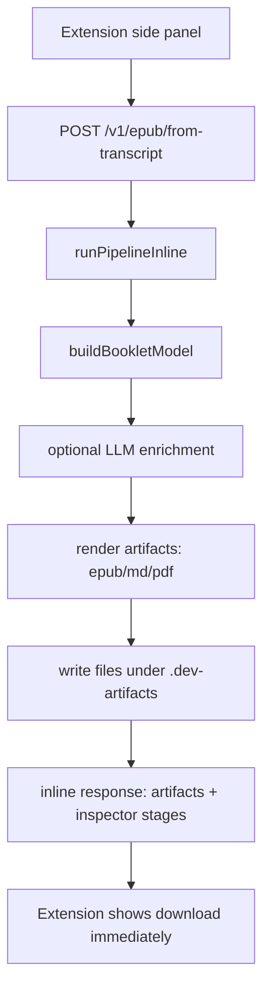
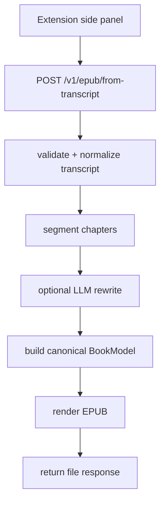
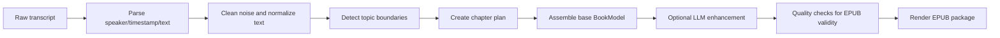

# Podcasts_to_ebooks Workspace

A Chrome extension + backend that turns podcast transcripts into ebooks.

This project is used by one person, so the architecture should stay simple, explicit, and easy to debug.

## Project Scope (Read First)

- This is a single-user product.
- The core goal is high-quality transcript -> EPUB output.
- Prefer straightforward implementations that are easy to reason about.
- Do not overengineer for scale, workflows, or abstractions we do not need yet.
- Add complexity only when it clearly improves output quality or fixes repeated real pain.

## What Exists Today

- Chrome extension side panel submits transcript text.
- Express backend runs generation inline (same request lifecycle, no worker queue).
- `POST /v1/epub/from-transcript` is now DB-free for core transcript -> EPUB runs.
- PostgreSQL is only required for `/v1/jobs/*` compatibility/history endpoints.
- Artifacts are written to local disk (`.dev-artifacts/`) and exposed via download URLs.
- Primary endpoint (`/v1/epub/from-transcript`) returns artifact + inspector data inline when generation succeeds.

## Quick Start

```bash
cd backend
cp .env.example .env
npm install
psql "$DATABASE_URL" -f migrations/0001_init.sql
npm run dev
```

Or from repo root:

```bash
./scripts/dev-up.sh
```

If you only use `POST /v1/epub/from-transcript`, Postgres is optional.
If you use `/v1/jobs/*` or transcript history APIs, Postgres is required.

## Live E2E Observability Dashboard

Use this when you want a result-first transcript -> EPUB loop with visible stage-by-stage progress.

One command startup (recommended):

```bash
./run_e2e_debug.sh
```

This script handles:

- PostgreSQL startup + stale `postmaster.pid` cleanup
- backend env/migration/build/start
- dashboard launch (`scripts/observe-transcript-run.mjs`)

Manual dashboard-only start (if backend is already running):

```bash
node scripts/observe-transcript-run.mjs
```

What you get:

- sample picker (local samples + recent transcript runs)
- one-click E2E run (`/v1/jobs/from-transcript`)
- `Version A Storyboard`: narrative flow + stage cards
- live stage timeline (`transcript`, `normalization`, `llm_request`, `llm_response`, etc.)
- final EPUB + Markdown result panel
- shareable debug state in URL query:
  - `method=C`
  - `sample=<sample_id>`

Local sample files live in:

```text
tasks/transcript-samples/
data/transcripts/
```

## API Surface (Current)

| Method | Path | Status |
| --- | --- | --- |
| `POST` | `/v1/epub/from-transcript` | Primary DB-free transcript -> EPUB entrypoint (EPUB-only, no `output_formats` required, inline artifacts/inspector on success) |
| `POST` | `/v1/jobs/from-transcript` | Backward-compatible DB-backed transcript entrypoint |
| `GET` | `/v1/jobs/{id}` | Used for status polling |
| `GET` | `/v1/jobs/{id}/artifacts` | Used for downloads |
| `GET` | `/v1/jobs/{id}/inspector` | Used for debug trace |

Auth for local dev:

- `Authorization: Bearer dev-token`
- `Authorization: Bearer dev:you@example.com`

## Architecture (Today)



Important: there is no background queue right now. The pipeline runs inline in the backend process.
`/v1/jobs/*` remains as DB-backed compatibility mode.

## Target Simplification (Planned)



Optional lightweight record (only if needed later): save one `run` row for audit/debug, but no queue semantics.

## Transcript -> EPUB Pipeline (Core Logic)



## Failure Policy

- Do not hide failures with silent fallbacks.
- If LLM mode is enabled and fails, return explicit error details.
- Keep deterministic (non-LLM) mode explicit, not implicit.

## Repo Map

```text
.
├── backend/
│   └── src/
│       ├── routes/          # API handlers
│       ├── services/        # Job orchestration
│       ├── repositories/    # DB + generation + rendering (currently mixed)
│       └── config.ts
├── extension/
│   ├── sidepanel/           # Main UI
│   └── src/api/             # API client
├── docs/
├── scripts/
└── tasks/method-compare/
```
