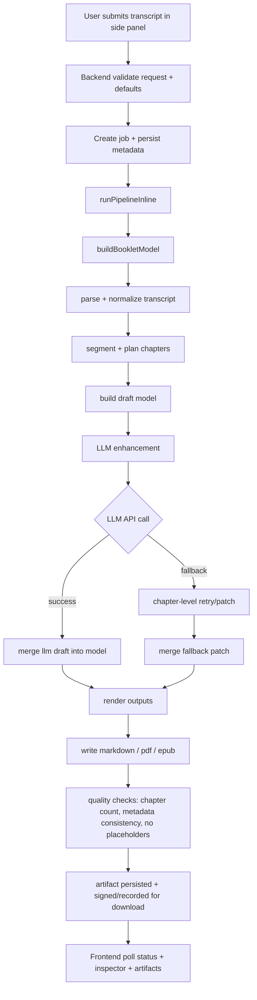

# Podcasts_to_ebooks Workspace

This workspace contains product specs, backend skeleton code, and extension API integration files.

## Structure

- `docs/`: approved V1 specs and contracts
- `assets/templates/`: initial EPUB template baseline asset
- `backend/`: TypeScript API skeleton + migration
- `extension/src/api/`: typed API client for side panel integration

## Backend Quick Start

1. Copy env:
```bash
cd backend
cp .env.example .env
```
2. Install deps:
```bash
npm install
```
3. Apply migration:
```bash
psql "$DATABASE_URL" -f migrations/0001_init.sql
```
4. Run dev server:
```bash
npm run dev
```

## One-Command Dev Scripts

From repo root:

```bash
./scripts/dev-up.sh
```

- Starts PostgreSQL service
- Ensures DB exists
- Applies migration
- Installs backend deps
- Starts backend on `:8080` if not already running

Smoke test:

```bash
./scripts/dev-smoke.sh
```

Stop local services:

```bash
./scripts/dev-down.sh
```

## Local Auth Convention (dev)

Use:

- `Authorization: Bearer dev-token`
or
- `Authorization: Bearer dev:you@example.com`

## Implemented V1 Endpoints

- `POST /v1/jobs/from-transcript`
- `POST /v1/rss/parse`
- `POST /v1/jobs/from-rss`
- `POST /v1/jobs/from-audio`
- `POST /v1/jobs/from-link`
- `GET /v1/jobs/{job_id}`
- `GET /v1/jobs/{job_id}/artifacts`
- `GET /v1/jobs/{job_id}/events`

## Notes

- Current worker is in-process simulation for end-to-end flow testing.
- Replace simulated artifact URLs and ingestion pipeline with production workers/object storage next.

## Extension MVP

- Manifest + popup + side panel UI are in `extension/`.
- Load instructions: `extension/README.md`.

## End-to-end generation flow



### How template and prompts are used

- The runtime template id is currently kept as a stable default (`templateA-v0-book`) and acts as a canonical structure contract.
- System prompts are applied in `bookletLlm` when optional LLM enhancement is enabled.
- LLM is invoked at the draft/patch step in the pipeline (see `generateBookletDraftWithLlm` and `generateChapterPatchWithLlm`).
- Final output rendering still uses the same `BookletModel` across epub/pdf/md to keep section order and metadata aligned.
