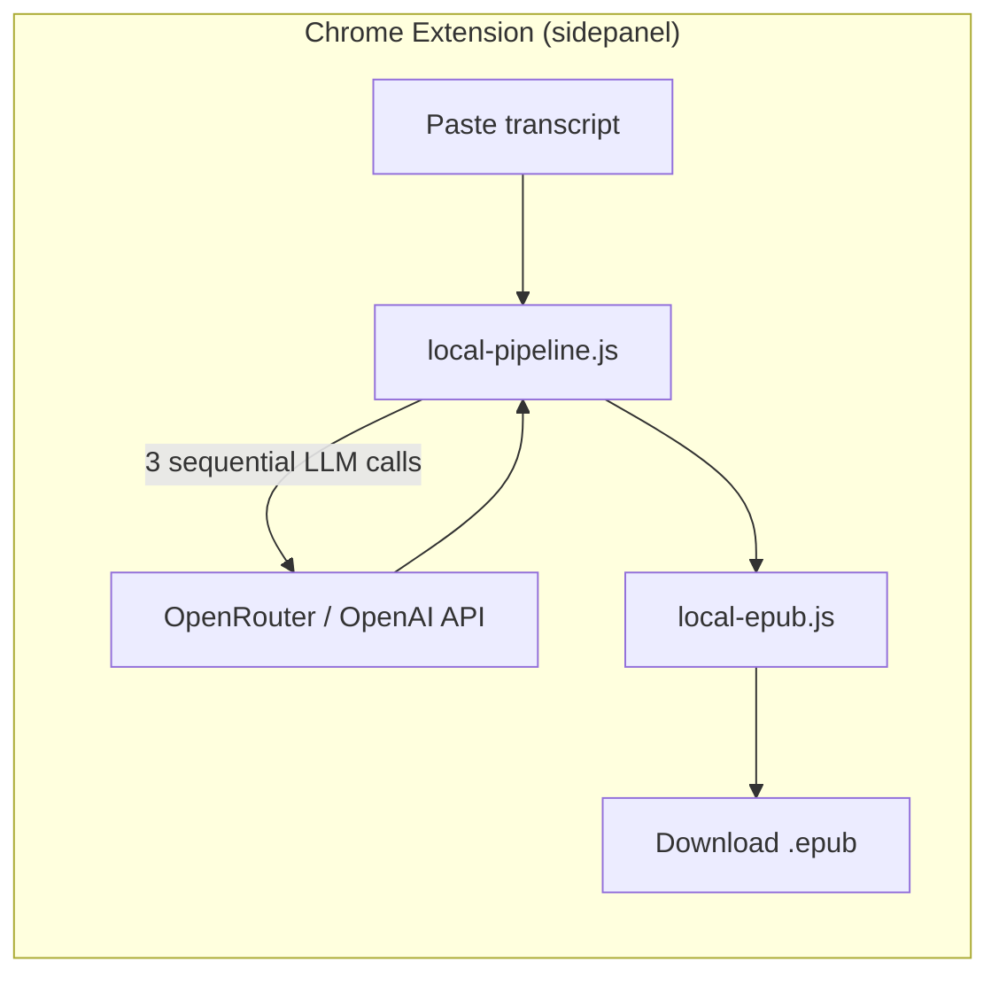
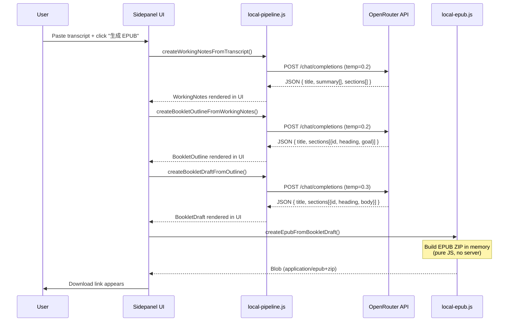
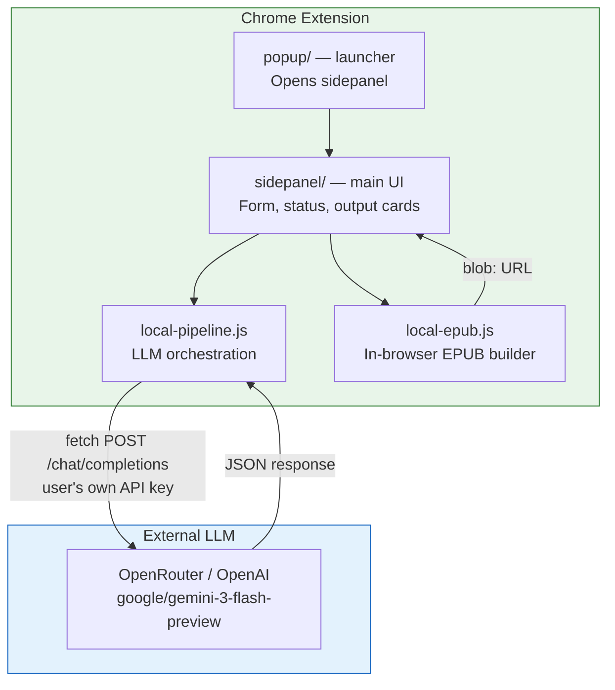
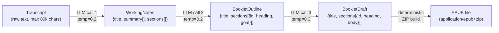
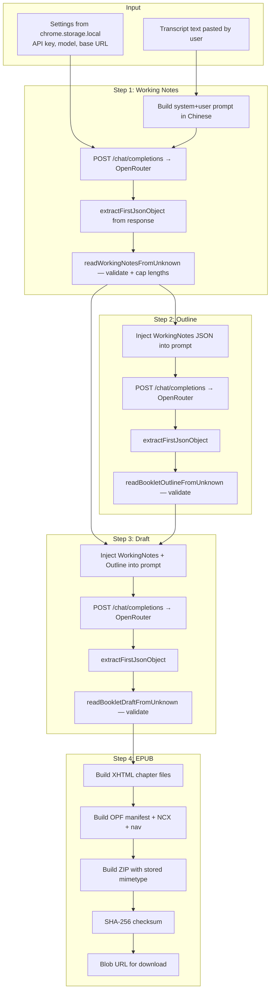
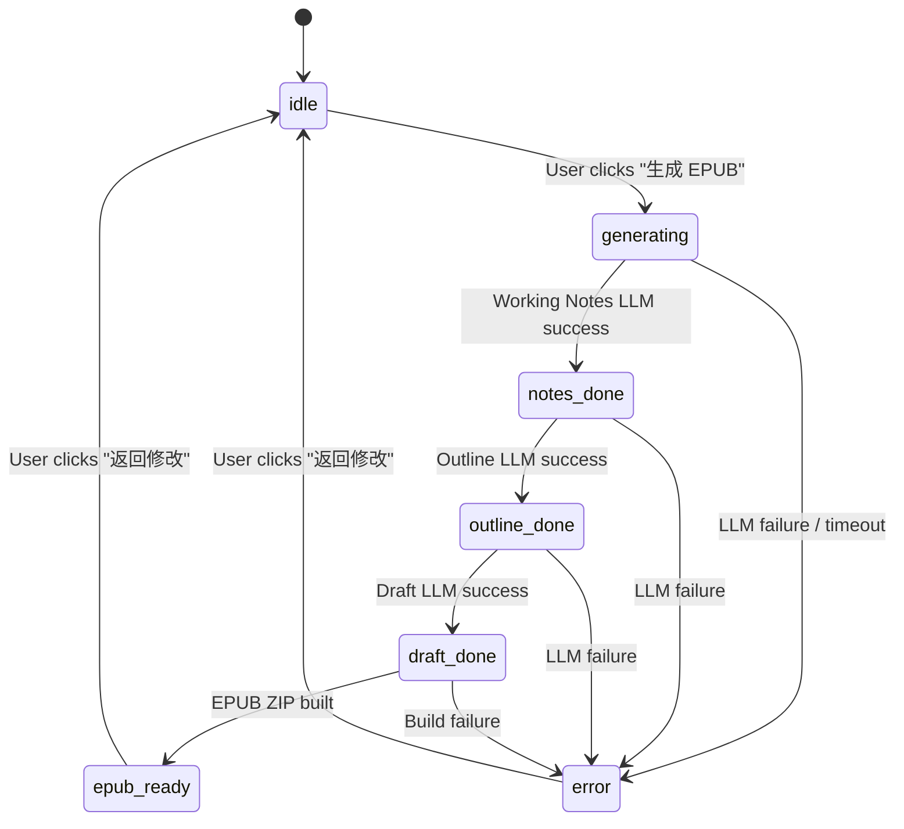

# Podcasts to Ebooks

A Chrome extension that turns Chinese podcast transcripts into structured EPUB ebooks using LLM-powered summarization. Paste a transcript, click "生成 EPUB", download an EPUB.

This is a single-user project. The architecture is intentionally simple, explicit, and easy to debug.

---

## System Overview



The extension is **fully self-contained** — it calls the LLM provider directly from the browser using the user's own API key. No backend server required.

### What happens when a user clicks "生成 EPUB"



---

## Architecture Diagram



### Architectural Boundaries

| Boundary | Left side | Right side | Contract |
|---|---|---|---|
| **Extension ↔ LLM** | `local-pipeline.js` | OpenRouter/OpenAI | OpenAI Chat Completions API (`POST /chat/completions`) with `response_format: json_object` |
| **Extension ↔ Storage** | `sidepanel.js` | `chrome.storage.local` | Three keys: `pte_settings_v2` (LLM config), `pte_workspace_v1` (session state), `pte_history_v1` (generation history) |

---

## Domain Model

The pipeline transforms data through four stages. Each stage has a typed schema:



### Entity Schemas

```
TranscriptInput
├── title: string               # auto-generated if blank
├── language: string             # hardcoded "zh-CN"
└── transcript_text: string      # raw paste, max 80,000 chars

WorkingNotes
├── title: string
├── summary: string[]            # 3-7 bullet points
└── sections[]                   # 3-8 sections
    ├── heading: string
    ├── bullets: string[]        # key points
    └── excerpts: string[]       # verbatim quotes from transcript

BookletOutline
├── title: string
└── sections[]                   # 3-8 sections
    ├── id: string               # e.g. "sec_01"
    ├── heading: string
    └── goal?: string            # what this section accomplishes

BookletDraft
├── title: string
└── sections[]                   # 3-8 sections
    ├── id: string               # matches outline section ID
    ├── heading: string
    └── body: string             # prose, max 4,000 chars/section

EPUB Artifact
├── download_url: string         # blob: URL
└── checksum_sha256: string
```

---

## Data Flow: Extension Pipeline



### State Machine (UI)

All four steps run automatically after the user clicks "生成 EPUB":



The workspace is saved to `chrome.storage.local` after each successful pipeline run. Closing and reopening the sidepanel restores the last state.

---

## Extension Files

**Owns:** User interface, LLM orchestration, EPUB generation, session persistence, generation history.

**Depends on:** OpenRouter or OpenAI API (user's own key).

| File | Role |
|---|---|
| `manifest.json` | Chrome MV3 manifest. Permissions: `sidePanel`, `storage`, `unlimitedStorage`. Host permissions: `openrouter.ai`, `api.openai.com`. |
| `popup/popup.js` | One button — opens the sidepanel via `chrome.sidePanel.open()` |
| `sidepanel/sidepanel.js` | UI controller. Manages form state, pipeline orchestration, workspace save/restore, history, stage trace rendering. |
| `sidepanel/local-pipeline.js` | Three exported functions for the staged LLM pipeline. Validates host allowlist, builds prompts, calls `/chat/completions`, parses JSON, validates schemas. |
| `sidepanel/local-epub.js` | Builds a valid EPUB 3 ZIP entirely in memory using a hand-written ZIP writer (`buildStoredZip`). No compression (stored method). Computes SHA-256 via `crypto.subtle`. |
| `sidepanel/sidepanel.html` | Sidepanel UI: input form, pipeline stepper, slide-out modals (notes, outline, draft, history, settings). |

**Key invariants:**
- LLM host must be in `SUPPORTED_LLM_HOSTS`: `openrouter.ai` or `api.openai.com`
- Transcript input capped at 80,000 chars
- LLM timeout: 90 seconds per call
- EPUB generation is deterministic — same draft always produces same EPUB

---

## LLM Integration

| Parameter | Value |
|---|---|
| Provider | OpenRouter (`https://openrouter.ai/api/v1`) or OpenAI |
| Model | `google/gemini-3-flash-preview` |
| Protocol | OpenAI Chat Completions API |
| Response format | `{ type: "json_object" }` |
| Timeout | 90 seconds per call |
| Input cap | 80,000 characters |
| Temperature | 0.2 (notes, outline), 0.3 (draft) |

**Authentication:** The user's API key is stored in `chrome.storage.local`. It never leaves the browser except to the configured LLM provider.

**JSON extraction:** LLM responses are parsed with a hand-written brace-matching parser (`extractFirstJsonObject`) that handles markdown fences and nested objects. Parsed output is then run through typed validators (`readWorkingNotesFromUnknown`, etc.) that enforce field types and length caps.

**Failure policy:** All LLM failures throw explicit errors with codes (`LLM_UNAVAILABLE`, `LLM_HTTP_ERROR`, `WORKING_NOTES_PARSE_FAILED`). No silent fallbacks.

---

## Observability: Inspector Stages

Every pipeline step records an `InspectorStageRecord` trace:

```
{ stage: "transcript" | "normalization" | "llm_request" | "llm_response" | "epub",
  ts: ISO timestamp,
  input?: { preview, charCount },
  config?: { model, temperature },
  output?: { preview, charCount } }
```

These traces are:
- Saved in `chrome.storage.local` as part of the workspace
- Rendered in the sidepanel's collapsible "调试日志" section

---

## Quick Start

1. Load `extension/` as an unpacked Chrome extension
2. Click the extension icon → opens the sidepanel
3. Open Settings (⚙️), enter your OpenRouter API key
4. Paste a Chinese podcast transcript
5. Click "生成 EPUB" — all four steps run automatically
6. Download the EPUB when it's ready

---

## Repo Map

```text
.
├── extension/                    # Chrome extension (the product)
│   ├── manifest.json             # MV3 manifest
│   ├── popup/                    # Launcher (opens sidepanel)
│   └── sidepanel/
│       ├── sidepanel.html/js/css # Main UI
│       ├── local-pipeline.js     # LLM orchestration (3 staged calls)
│       └── local-epub.js         # In-browser EPUB builder
├── scripts/
│   └── committer                 # Git commit helper
├── docs/                         # Architecture + decision docs
├── tasks/transcript-samples/     # Small fixture transcripts
└── assets/
    ├── fonts/                    # CJK font for EPUB rendering
    └── templates/                # Baseline EPUB template
```

---

## Key Design Decisions

1. **Extension is serverless.** The Chrome extension calls the LLM directly — no backend in the loop. This eliminates deployment, hosting, and networking complexity for a single-user tool.

2. **Staged pipeline.** Breaking transcript→EPUB into four explicit steps (notes → outline → draft → epub) lets the user inspect each stage via slide-out modals.

3. **EPUB built in-browser.** `local-epub.js` constructs a valid EPUB 3 ZIP using a hand-written ZIP writer. No server round-trip, no native dependencies. The file is served as a `blob:` URL.

4. **User provides their own API key.** The key is stored only in `chrome.storage.local`. It never touches a server.

5. **Chinese-first prompts.** All system prompts are written in Chinese to match the target content and audience.

6. **Deterministic JSON extraction.** LLM output is parsed with a brace-matching parser, not `JSON.parse` on the raw response. This handles models that wrap JSON in markdown fences.

7. **No silent fallbacks.** If an LLM call fails, the error surfaces visibly. The user can retry or adjust their input.

8. **Workspace persistence.** The full session state is saved to `chrome.storage.local` after each pipeline run. Closing and reopening the sidepanel restores everything.

9. **Generation history.** Each successful EPUB export is saved to a history list (up to 100 entries). Users can pin, delete, and reload past generations.

10. **`response_format: json_object`** is set on every LLM call to force structured output, reducing parse failures.
