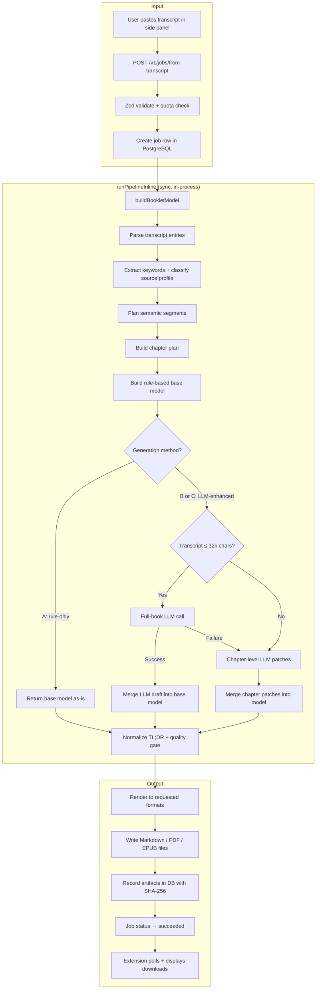
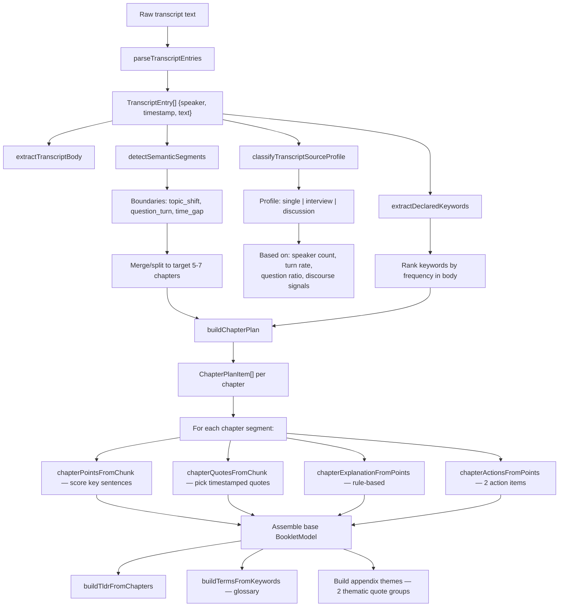
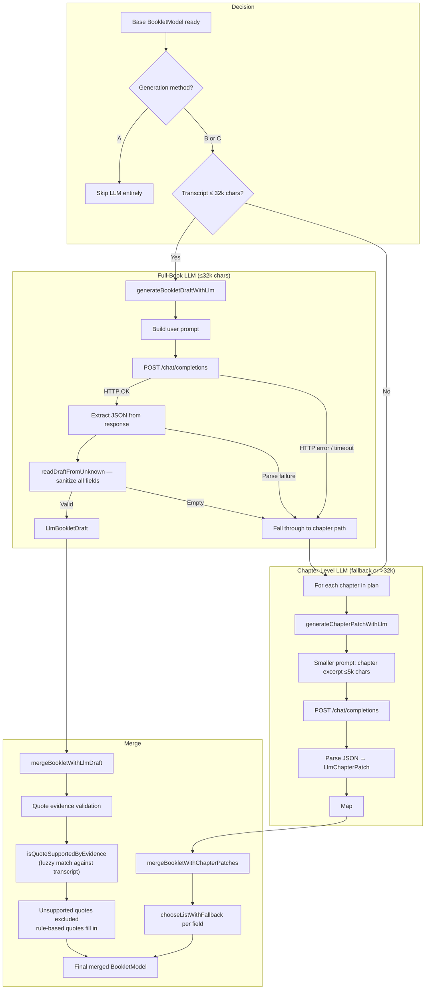
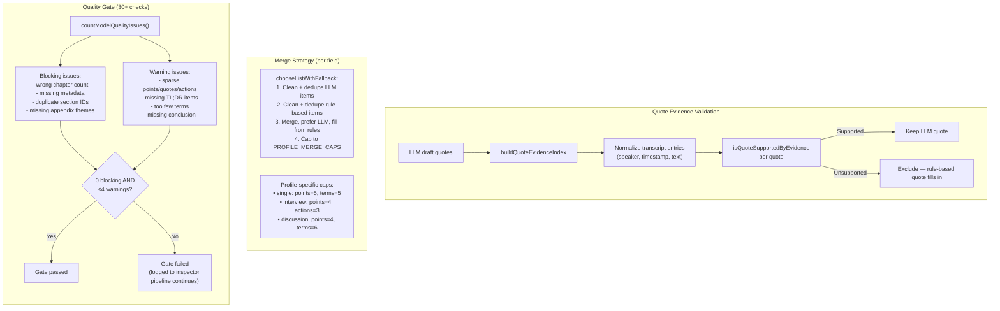
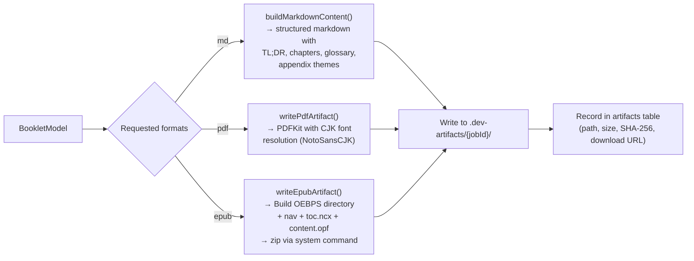

# Podcasts_to_ebooks Workspace

Converts Chinese podcast transcripts into structured "knowledge booklet" ebooks (EPUB/PDF/Markdown). A monolithic TypeScript Express backend handles the full pipeline — transcript parsing, semantic segmentation, rule-based chapter construction, optional LLM enhancement, and multi-format rendering — with a Chrome extension side panel as the primary UI.

## Structure

```
├── backend/src/
│   ├── index.ts              # Server entrypoint (Express on :8080)
│   ├── config.ts             # Env/config loading (LLM, DB, etc.)
│   ├── services/
│   │   ├── bookletLlm.ts     # LLM API calls, prompts, response parsing
│   │   └── jobsService.ts    # Job lifecycle, quota checks, pipeline trigger
│   ├── repositories/
│   │   └── jobsRepo.ts       # Core pipeline: parsing → segmentation → model → rendering
│   └── routes/v1.ts          # API route handlers
├── extension/                # Chrome extension (side panel UI)
├── scripts/                  # dev-up, dev-down, smoke-test, method comparison
├── docs/                     # Specs, contracts, OpenAPI, state machine
├── assets/                   # Fonts, EPUB baseline template
└── tasks/                    # Active TODOs, method comparison outputs
```

## Backend Quick Start

```bash
cd backend
cp .env.example .env          # configure DB + LLM keys
npm install
psql "$DATABASE_URL" -f migrations/0001_init.sql
npm run dev                   # starts on :8080
```

Or from repo root: `./scripts/dev-up.sh` (starts PG, migrates, builds, runs).

## API Endpoints

| Method | Path | Description |
|--------|------|-------------|
| `POST` | `/v1/jobs/from-transcript` | Main path — submit transcript text |
| `POST` | `/v1/jobs/from-rss` | RSS URL + episode ID (stub) |
| `POST` | `/v1/jobs/from-link` | Episode URL (stub) |
| `POST` | `/v1/jobs/from-audio` | Audio file upload (stub) |
| `GET`  | `/v1/jobs/{id}` | Poll job status |
| `GET`  | `/v1/jobs/{id}/artifacts` | Download URLs |
| `GET`  | `/v1/jobs/{id}/inspector` | Pipeline debug trace |

Auth: `Authorization: Bearer dev-token` or `Bearer dev:you@example.com`

---

## End-to-End Generation Flow

The full pipeline from user submission to downloadable artifact:



---

## Transcript Processing Pipeline

How a raw transcript becomes a structured `BookletModel`:



---

## LLM Enhancement Process

The LLM path enriches the rule-based base model. Two strategies depending on transcript length:



---

## LLM Request/Response Detail

What goes into and comes out of each LLM call:

```mermaid
flowchart LR
  subgraph Context["Context Assembled into Prompt"]
    direction TB
    A1[System prompt — 8 rules in Chinese]
    A2[Task description + hard rules]
    A3[JSON field contract / schema]
    A4[Chapter quality requirements]
    A5[Global quality self-check rules]
    A6["strict_template_a rules (Method C only)"]
    A7["Metadata: title, language,\nsource_type, source_ref"]
    A8["Chapter range hints (per chapter)"]
    A9["Chapter plan hints:\ntitle, range, intent, segment IDs,\nsignals, context excerpt,\nevidence anchors/quotes"]
    A10["Full transcript text\n(truncated to llmInputMaxChars)"]
  end

  subgraph API["OpenAI-compatible API Call"]
    direction TB
    B1["model: config.llmModel"]
    B2["temperature: 0.2"]
    B3["response_format: json_object"]
    B4["messages: [system, user]"]
    B5["timeout: config.llmTimeoutMs"]
  end

  subgraph Response["Response Handling"]
    direction TB
    C1[Raw response string]
    C2["extractFirstJsonObject\n(fenced ```json``` or {…} span)"]
    C3[JSON.parse]
    C4["readDraftFromUnknown\n- type check every field\n- cleanText: strip {PLACEHOLDER},\n  normalize whitespace\n- cap array lengths\n- validate quote structure"]
    C5["LlmBookletDraft | null"]
  end

  Context --> API --> Response
```



### LLM Output Schema (Full-Book Draft)

```json
{
  "suitableFor": ["string × 3-5"],
  "outcomes": ["string × 3-5"],
  "oneLineConclusion": "string",
  "tldr": ["string × 5-7"],
  "chapters": [
    {
      "title": "string",
      "points": ["string × 3-5"],
      "quotes": [{ "speaker": "str", "timestamp": "str", "text": "str" }],
      "explanation": {
        "background": "string",
        "coreConcept": "string",
        "judgmentFramework": "string",
        "commonMisunderstanding": "string"
      },
      "actions": ["string × 2-4"]
    }
  ],
  "actionNow": ["string × 2-3"],
  "actionWeek": ["string × 2-3"],
  "actionLong": ["string × 1-2"],
  "terms": [{ "term": "str", "definition": "str" }],
  "appendixThemes": [{ "name": "str", "quotes": [{ "speaker": "...", "timestamp": "...", "text": "..." }] }]
}
```

### Chapter-Level Patch Schema (Fallback)

```json
{
  "points": ["string × 3-5"],
  "explanation": {
    "background": "string",
    "coreConcept": "string",
    "judgmentFramework": "string",
    "commonMisunderstanding": "string"
  },
  "actions": ["string × 2-4"]
}
```

---

## LLM Settings & Configuration

All LLM settings are loaded in `backend/src/config.ts` from environment variables:

| Setting | Env Var | Default | Where Used |
|---------|---------|---------|------------|
| **Model** | `OPENROUTER_MODEL` / `OPENAI_MODEL` | `gpt-4.1-mini` | `config.ts:24` → `bookletLlm.ts:410` |
| **Base URL** | `OPENROUTER_BASE_URL` / `OPENAI_BASE_URL` | `https://openrouter.ai/api/v1` | `config.ts:20-23` → `bookletLlm.ts:425` |
| **API Key** | `OPENROUTER_API_KEY` / `OPENAI_API_KEY` | (none) | `config.ts:19` → `bookletLlm.ts:438` |
| **Temperature** | *(hardcoded)* | `0.2` | `bookletLlm.ts:411` |
| **Response format** | *(hardcoded)* | `{ type: "json_object" }` | `bookletLlm.ts:412` |
| **Timeout** | `OPENROUTER_TIMEOUT_MS` / `OPENAI_TIMEOUT_MS` | `45000` ms | `config.ts:25` → `bookletLlm.ts:401` |
| **Chapter patch timeout** | *(derived)* | `min(llmTimeoutMs, 20000)` | `bookletLlm.ts:506` |
| **Input max chars** | `OPENROUTER_INPUT_MAX_CHARS` / `OPENAI_INPUT_MAX_CHARS` | `80000` | `config.ts:26` → `bookletLlm.ts:403` |
| **Full-book LLM threshold** | *(hardcoded)* | `32000` chars | `jobsRepo.ts:742` |

OpenRouter is the primary provider with OpenAI as fallback. The env vars cascade: `OPENROUTER_*` → `OPENAI_*` → default.

### Generation Methods

| Method | Prompt Profile | Behavior |
|--------|---------------|----------|
| **A** | *(none)* | Parser/rule-first only. LLM disabled. |
| **B** (default) | `baseline` | Semantic plan + full-book or chapter-level LLM merge. |
| **C** | `strict_template_a` | Same as B with stricter chapter quality enforcement in prompt. |

### Prompt Profiles

- **`baseline`** — standard prompt with JSON contract, quality self-check rules, and chapter plan hints.
- **`strict_template_a`** — adds extra rules: 5-7 chapter recommendation, ≥2 timestamped quotes per chapter, evidence-backed TL;DR, verb-first executable actions.

---

## Merge & Quality Gate

How LLM output gets validated and merged back into the base model:



---

## Rendering Pipeline

The final `BookletModel` is rendered to one or more output formats:



---

## Extension MVP

Chrome extension with side panel UI (`extension/`).

- Auto-generates title from transcript keywords
- Submits to `POST /v1/jobs/from-transcript` (always requests EPUB, defaults to Method B)
- Polls `GET /v1/jobs/{id}` every 1.2s until `succeeded`
- Displays inspector stages and artifact download links
- Load instructions: `extension/README.md`

## Notes

- Current worker is in-process (no background queue). Pipeline runs synchronously inside the HTTP request handler.
- Storage is local filesystem (`.dev-artifacts/`); no cloud object storage yet.
- PostgreSQL for job metadata, artifacts, and compliance records.
- Quality gate is currently informational only (logged to inspector; pipeline does not hard-fail).
