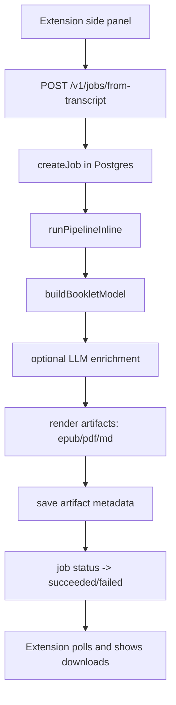
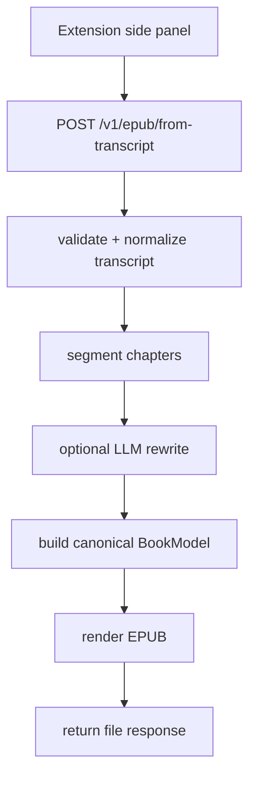
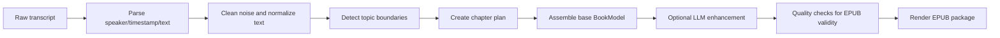

# Podcasts_to_ebooks Workspace

A Chrome extension + backend that turns podcast transcripts into ebooks.

This project is used by one person, so the architecture should stay simple, explicit, and easy to debug.

## What Exists Today

- Chrome extension side panel submits transcript text.
- Express backend runs generation inline (same request lifecycle, no worker queue).
- PostgreSQL stores job metadata and artifact records.
- Artifacts are written to local disk (`.dev-artifacts/`) and exposed via download URLs.

## Quick Start

```bash
cd backend
cp .env.example .env
npm install
psql "$DATABASE_URL" -f migrations/0001_init.sql
npm run dev
```

Or from repo root:

```bash
./scripts/dev-up.sh
```

## API Surface (Current)

| Method | Path | Status |
| --- | --- | --- |
| `POST` | `/v1/epub/from-transcript` | Simplified transcript -> epub entrypoint (EPUB-only, no `output_formats` required) |
| `POST` | `/v1/jobs/from-transcript` | Backward-compatible transcript entrypoint |
| `GET` | `/v1/jobs/{id}` | Used for status polling |
| `GET` | `/v1/jobs/{id}/artifacts` | Used for downloads |
| `GET` | `/v1/jobs/{id}/inspector` | Used for debug trace |

Auth for local dev:

- `Authorization: Bearer dev-token`
- `Authorization: Bearer dev:you@example.com`

## Architecture (Today)



Important: there is no background queue right now. The pipeline runs inline in the backend process.

## Target Simplification (Planned)



Optional lightweight record (only if needed later): save one `run` row for audit/debug, but no queue semantics.

## Transcript -> EPUB Pipeline (Core Logic)



## Failure Policy

- Do not hide failures with silent fallbacks.
- If LLM mode is enabled and fails, return explicit error details.
- Keep deterministic (non-LLM) mode explicit, not implicit.

## Repo Map

```text
.
├── backend/
│   └── src/
│       ├── routes/          # API handlers
│       ├── services/        # Job orchestration
│       ├── repositories/    # DB + generation + rendering (currently mixed)
│       └── config.ts
├── extension/
│   ├── sidepanel/           # Main UI
│   └── src/api/             # API client
├── docs/
├── scripts/
└── tasks/todo.md
```
