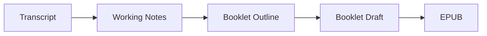
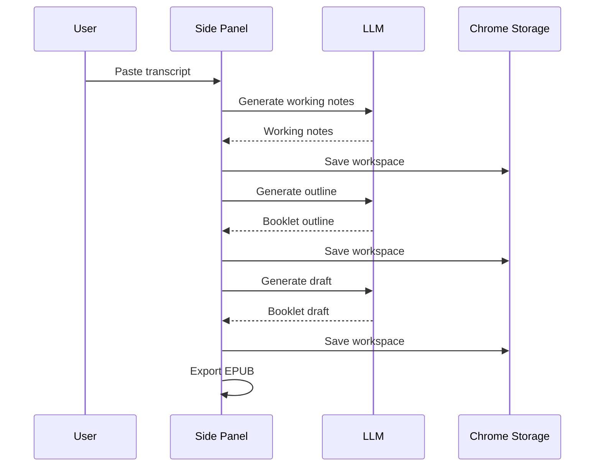

# Podcasts_to_ebooks Workspace

This repo is now primarily a local Chrome extension workflow for turning a transcript into an EPUB.

The current product path is:

`transcript -> working notes -> booklet outline -> booklet draft -> epub`

## What Exists Today

- The Chrome extension side panel is the main product surface.
- The extension calls the LLM directly from the browser.
- Intermediate artifacts are visible in the UI:
  - `Working Notes`
  - `Booklet Outline`
  - `Booklet Draft`
  - stage trace
- Workspace state is saved in `chrome.storage.local`.
- EPUB export happens directly in the browser.

## What This Repo Is Not Doing Right Now

- no background jobs
- no required local backend for the extension workflow
- no compliance declaration objects in the product path
- no required PDF or Markdown export in the main path
- no transcript segmentation unless we later prove we need it

There is still backend code in the repo, but it is no longer the primary workflow for the extension.

## Quick Start

### Extension-first workflow

1. Open `chrome://extensions`
2. Enable **Developer mode**
3. Click **Load unpacked**
4. Select `extension/`
5. Open the side panel
6. Fill in:
   - LLM Base URL
   - model
   - API key
7. Paste a transcript
8. Run the stages in order:
   - `Working Notes`
   - `Outline`
   - `Draft`
   - `Export EPUB`

## Current Product Flow

### Diagram: Flowchart - Local extension pipeline



What it shows:
- the current happy path

Why it matters:
- this is the product flow we are actively iterating on

### Diagram: Sequence - Side panel generation



What it shows:
- the side panel owns the generation loop

Why it matters:
- the extension no longer depends on `localhost` to run the main workflow

## Current Stage Contracts

These are the main objects visible in the extension today.

```ts
type WorkingNotes = {
  title: string
  summary: string[]
  sections: {
    heading: string
    bullets: string[]
    excerpts: string[]
  }[]
}

type BookletOutline = {
  title: string
  sections: {
    id: string
    heading: string
    goal?: string
  }[]
}

type BookletDraft = {
  title: string
  sections: {
    id: string
    heading: string
    body: string
  }[]
}
```

## Observability

The side panel already shows the main artifacts and a stage trace.

That means you can inspect:

- what the model produced for notes
- how the outline changed the structure
- what the draft actually says
- what was finally exported as EPUB

## Repo Map

```text
.
├── README.md
├── data/
│   └── transcripts/              # Larger real transcript samples
├── tasks/
│   ├── method-compare/           # Older comparison outputs
│   ├── transcript-samples/       # Smaller local fixtures
│   └── todo.md
├── backend/                      # Older backend pipeline and experiments
├── extension/
│   ├── README.md
│   ├── manifest.json
│   ├── sidepanel/
│   │   ├── sidepanel.html
│   │   ├── sidepanel.js
│   │   ├── local-pipeline.js
│   │   └── local-epub.js
│   └── popup/
├── docs/
├── scripts/
└── assets/
```

## Suggested Next Work

1. Improve output quality on real transcript samples.
2. Refine the UI only after the artifacts themselves look good.
3. Clean up or archive stale backend-era docs and scripts that no longer describe the main path.
