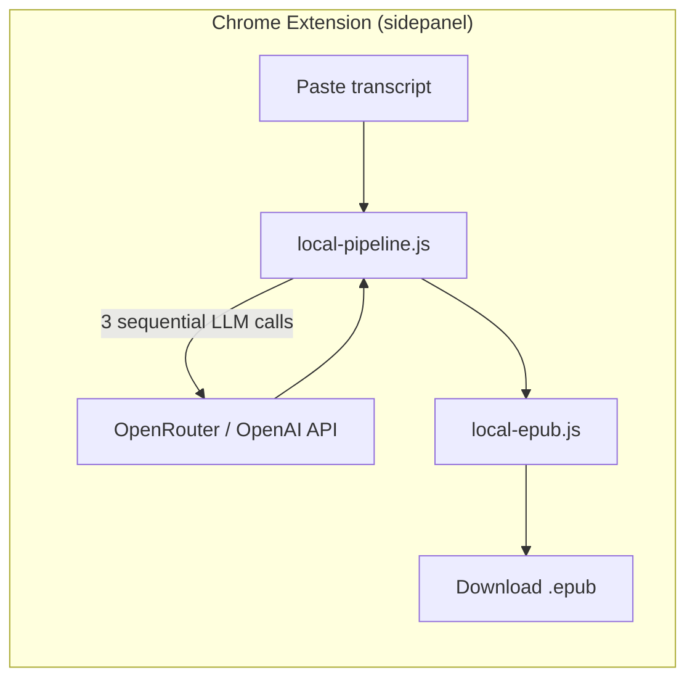
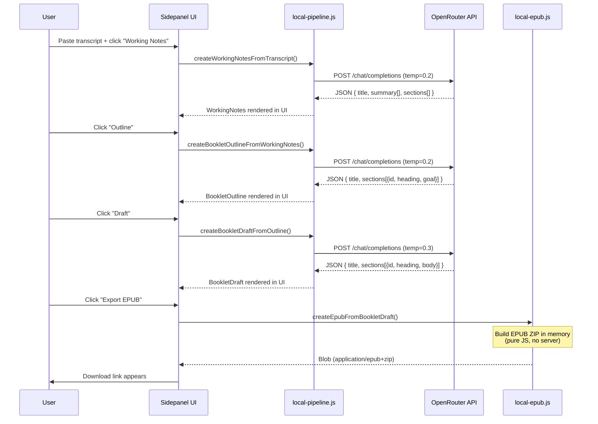
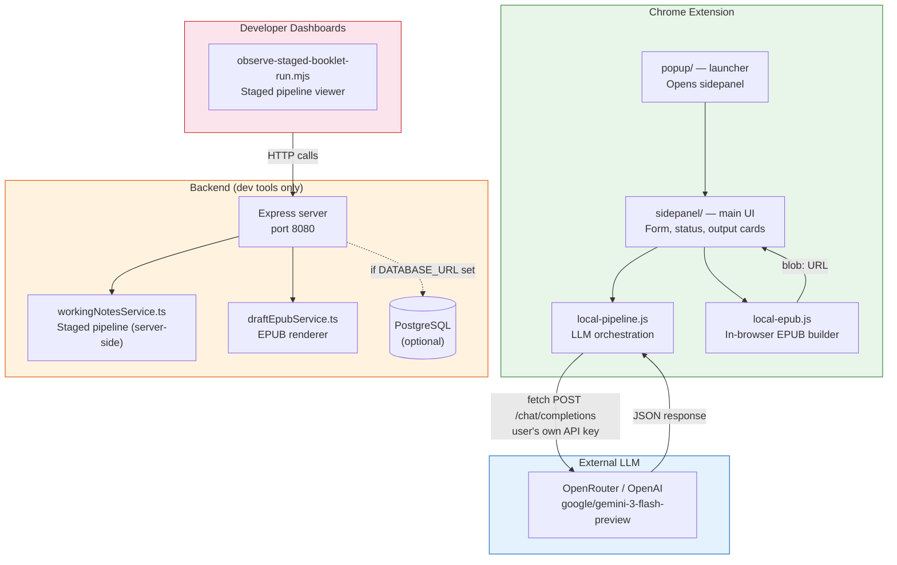
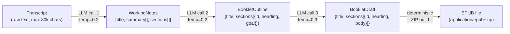
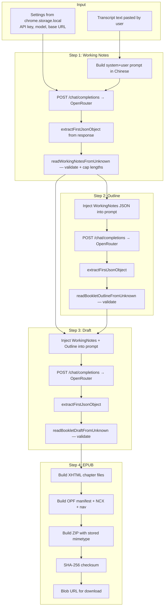
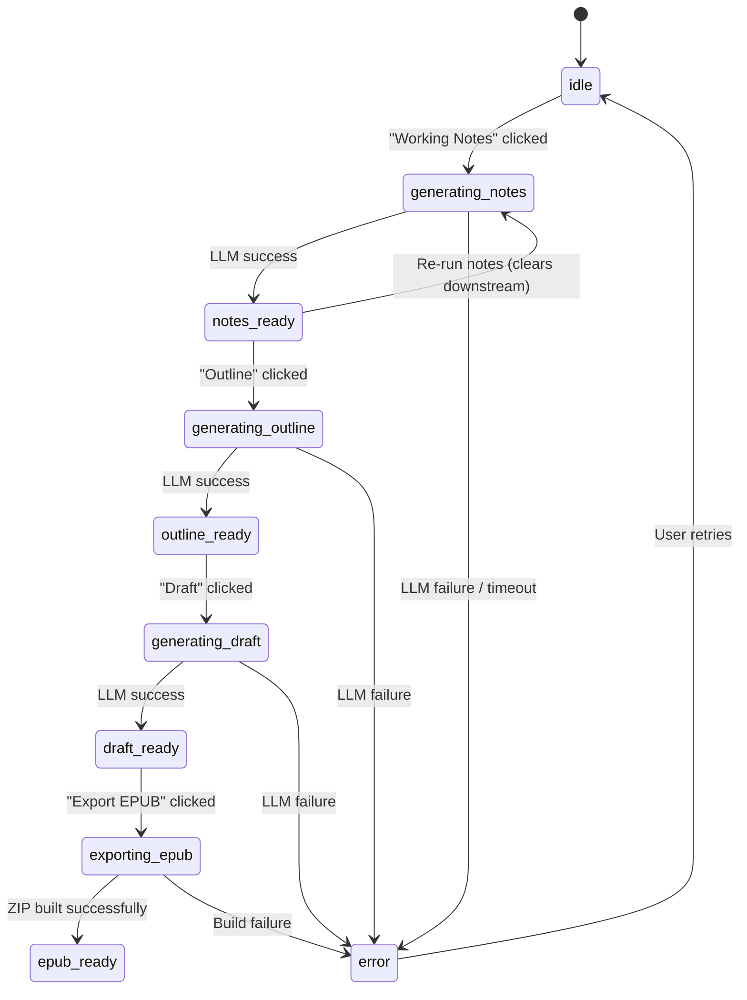

# Podcasts to Ebooks

A Chrome extension that turns Chinese podcast transcripts into structured EPUB ebooks using LLM-powered summarization. Paste a transcript, click through four steps, download an EPUB.

This is a single-user project. The architecture is intentionally simple, explicit, and easy to debug.

---

## System Overview



The extension is **fully self-contained** — it calls the LLM provider directly from the browser using the user's own API key. There is no backend server required for the primary workflow. The backend exists only for developer tooling (observability dashboards, regression tests, method comparisons).

### What happens when a user clicks through the flow



---

## Architecture Diagram



### Architectural Boundaries

| Boundary | Left side | Right side | Contract |
|---|---|---|---|
| **Extension ↔ LLM** | `local-pipeline.js` | OpenRouter/OpenAI | OpenAI Chat Completions API (`POST /chat/completions`) with `response_format: json_object` |
| **Extension ↔ Storage** | `sidepanel.js` | `chrome.storage.local` | Two keys: `pte_settings_v2` (LLM config), `pte_workspace_v1` (full session state) |
| **Backend ↔ LLM** | `workingNotesService.ts` | OpenRouter | Same Chat Completions API, configured via env vars |
| **Backend ↔ Disk** | `draftEpubService.ts` | `.dev-artifacts/` | EPUB files written per run ID |
| **Backend ↔ DB** | `usersRepo.ts` | PostgreSQL | Optional — only needed for user records |
| **Dashboards ↔ Backend** | `observe-staged-booklet-run.mjs` | Express routes | HTTP POST to `/v1/*` endpoints |

---

## Domain Model

The pipeline transforms data through four stages. Each stage has a typed schema:



### Entity Schemas

```
TranscriptInput
├── title: string               # auto-generated if blank
├── language: string             # hardcoded "zh-CN"
└── transcript_text: string      # raw paste, max 80,000 chars

WorkingNotes
├── title: string
├── summary: string[]            # 3-7 bullet points
└── sections[]                   # 3-8 sections
    ├── heading: string
    ├── bullets: string[]        # key points
    └── excerpts: string[]       # verbatim quotes from transcript

BookletOutline
├── title: string
└── sections[]                   # 3-8 sections
    ├── id: string               # e.g. "sec_01"
    ├── heading: string
    └── goal?: string            # what this section accomplishes

BookletDraft
├── title: string
└── sections[]                   # 3-8 sections
    ├── id: string               # matches outline section ID
    ├── heading: string
    └── body: string             # prose, max 4,000 chars/section

EPUB Artifact
├── download_url: string         # blob: URL (extension) or /downloads/ URL (backend)
├── checksum_sha256: string
└── expires_at?: string          # 1 hour for backend artifacts
```

---

## Data Flow: Extension Pipeline (Primary)



### State Machine (UI)

Each step transitions the UI through states:



The workspace is saved to `chrome.storage.local` after each successful step. Closing and reopening the sidepanel restores the last state.

---

## Subsystem Breakdown

### 1. Chrome Extension (`extension/`)

**Owns:** User interface, LLM orchestration, EPUB generation, session persistence.

**Depends on:** OpenRouter or OpenAI API (user's own key). No backend dependency.

**Files:**

| File | Role |
|---|---|
| `manifest.json` | Chrome MV3 manifest. Permissions: `sidePanel`, `storage`. Host permissions: `openrouter.ai`, `api.openai.com`. No background worker, no content scripts. |
| `popup/popup.js` | One button — opens the sidepanel via `chrome.sidePanel.open()` |
| `sidepanel/sidepanel.js` | UI controller. Manages form state, button flow guards, workspace save/restore, stage trace rendering. Calls `local-pipeline.js` and `local-epub.js`. |
| `sidepanel/local-pipeline.js` | Three exported functions for the staged LLM pipeline. Validates host allowlist, builds prompts, calls `/chat/completions`, parses JSON, validates schemas. |
| `sidepanel/local-epub.js` | Builds a valid EPUB 3 ZIP entirely in memory using a hand-written ZIP writer (`buildStoredZip`). No compression (stored method). Computes SHA-256 via `crypto.subtle`. |
| `sidepanel/sidepanel.html` | Eight card sections: hero, composer, status, outputs, working-notes, booklet-outline, booklet-draft, events (debug), settings |

**Interfaces exposed:** None (it's the leaf consumer).

**Key invariants:**
- LLM host must be in `SUPPORTED_LLM_HOSTS`: `openrouter.ai` or `api.openai.com`
- Transcript input capped at 80,000 chars
- LLM timeout: 90 seconds per call
- Generating new working notes clears cached outline and draft (downstream invalidation)
- EPUB generation is deterministic — same draft always produces same EPUB

### 2. Backend (`backend/`)

**Owns:** Server-side staged pipeline (mirrors extension logic), artifact persistence to disk.

**Depends on:** OpenRouter API (via `OPENROUTER_API_KEY` env var), optionally PostgreSQL.

**Interfaces exposed:**

| Method | Path | Purpose |
|---|---|---|
| `POST` | `/v1/working-notes/from-transcript` | Transcript → WorkingNotes (LLM) |
| `POST` | `/v1/booklet-outline/from-working-notes` | WorkingNotes → BookletOutline (LLM) |
| `POST` | `/v1/booklet-draft/from-booklet-outline` | WorkingNotes + BookletOutline → BookletDraft (LLM) |
| `POST` | `/v1/epub/from-booklet-draft` | BookletDraft → EPUB file (deterministic) |
| `GET` | `/healthz` | Health check |
| `GET` | `/downloads/:job_id/:file_name` | Artifact download (requires `?token=dev`) |

All `POST /v1/*` routes require `Authorization: Bearer dev-token` or `Bearer dev:<email>`.

All routes are **synchronous** — no background queue. The pipeline runs inline in the HTTP request.

**Key services:**

| Service | File | What it does |
|---|---|---|
| Working notes pipeline | `services/workingNotesService.ts` | Three functions for the staged LLM pipeline (working notes, outline, draft) |
| EPUB renderer | `services/draftEpubService.ts` | Builds EPUB from BookletDraft. No LLM. Writes to `.dev-artifacts/`. |

**Data handoffs:**
- `workingNotesService` → LLM → validated JSON back to caller
- `draftEpubService` → XHTML rendering → `zip` CLI → `.dev-artifacts/{jobId}/{jobId}.epub`

### 3. Developer Dashboards (`scripts/`)

**Owns:** Observability, quality comparison, regression testing.

**Depends on:** Running backend instance.

| Script | What it does |
|---|---|
| `observe-staged-booklet-run.mjs` | Web dashboard (port 4174). Runs the 4-step staged pipeline. Shows working notes, outline, draft, and EPUB as structured cards. |
| `run-staged-booklet-flow.mjs` | CLI runner for the staged pipeline. Saves EPUB + stage data to `.dev-artifacts/staged-runs/`. |
| `dev-up.sh` / `dev-down.sh` | Start/stop local dev stack (Postgres + backend). |
| `run-server.sh` | One-command backend launch (foreground). |
| `dev-smoke.sh` | Minimal smoke test (post working notes, check success). |

---

## LLM Integration

| Parameter | Value |
|---|---|
| Provider | OpenRouter (`https://openrouter.ai/api/v1`) or OpenAI |
| Model | `google/gemini-3-flash-preview` |
| Protocol | OpenAI Chat Completions API |
| Response format | `{ type: "json_object" }` |
| Timeout | 90 seconds per call |
| Input cap | 80,000 characters |
| Temperature | 0.2 (notes, outline), 0.3 (draft) |

**Authentication:** The extension stores the user's API key in `chrome.storage.local`. The backend reads from `OPENROUTER_API_KEY` or `OPENAI_API_KEY` env vars.

**JSON extraction:** LLM responses are parsed with a hand-written brace-matching parser (`extractFirstJsonObject`) that handles markdown fences and nested objects. Parsed output is then run through typed validators (`readWorkingNotesFromUnknown`, etc.) that enforce field types and length caps. No raw LLM output reaches downstream code.

**Failure policy:** All LLM failures throw explicit errors with codes (`LLM_UNAVAILABLE`, `LLM_HTTP_ERROR`, `WORKING_NOTES_PARSE_FAILED`). No silent fallbacks in the staged pipeline.

---

## Observability: Inspector Stages

Every pipeline step records an `InspectorStageRecord` trace:

```
{ stage: "transcript" | "normalization" | "llm_request" | "llm_response" | "epub",
  ts: ISO timestamp,
  input?: { preview, charCount },
  config?: { model, temperature },
  output?: { preview, charCount } }
```

These traces are:
- Returned inline in API responses (`stages[]` array)
- Saved in `chrome.storage.local` as part of the workspace
- Rendered in the sidepanel's collapsible "events" debug section
- Displayed in the observability dashboards as timeline cards

---

## Quick Start

### Using the Chrome Extension (primary workflow)

1. Load `extension/` as an unpacked Chrome extension
2. Click the extension icon → opens the sidepanel
3. Open Settings (bottom of sidepanel), enter your OpenRouter API key
4. Paste a Chinese podcast transcript
5. Click through: Working Notes → Outline → Draft → Export EPUB

No backend or database needed.

### Running the Backend (for dev tools)

```bash
cd backend
cp .env.example .env          # add OPENROUTER_API_KEY
npm install && npm run dev
```

Or use the one-command launcher:

```bash
./run_e2e_debug.sh            # starts Postgres + backend + dashboard
```

### Running the Observability Dashboard

```bash
# Staged 4-step pipeline viewer (port 4174)
node scripts/observe-staged-booklet-run.mjs
```

Transcript samples live in `tasks/transcript-samples/`.

---

## Repo Map

```text
.
├── extension/                    # Chrome extension (the product)
│   ├── manifest.json             # MV3 manifest, no background worker
│   ├── popup/                    # Launcher (opens sidepanel)
│   └── sidepanel/
│       ├── sidepanel.html/js/css # Main UI
│       ├── local-pipeline.js     # LLM orchestration (3 staged calls)
│       └── local-epub.js         # In-browser EPUB builder
├── backend/                      # Dev tools backend (not needed for extension)
│   └── src/
│       ├── app.ts                # Express wiring
│       ├── config.ts             # Env loading, LLM defaults
│       ├── routes/v1.ts          # 4 staged API endpoints
│       ├── services/
│       │   ├── workingNotesService.ts   # Staged pipeline (server-side)
│       │   └── draftEpubService.ts      # EPUB from BookletDraft
│       ├── repositories/
│       │   └── usersRepo.ts      # User upsert
│       ├── middleware/auth.ts    # Dev-token auth
│       └── lib/                  # Errors, async handler, ID generator
├── scripts/                      # Dev dashboards + test runners
│   ├── observe-staged-booklet-run.mjs
│   ├── run-staged-booklet-flow.mjs
│   ├── dev-up.sh / dev-down.sh
│   └── dev-smoke.sh
├── docs/                         # Architecture + decision docs
├── tasks/transcript-samples/     # Small fixture transcripts
├── assets/
│   ├── fonts/                    # CJK font for EPUB rendering
│   └── templates/                # Baseline EPUB template
└── run_e2e_debug.sh              # One-command dev environment
```

---

## Key Design Decisions

1. **Extension is serverless.** The Chrome extension calls the LLM directly — no backend in the loop. This eliminates deployment, hosting, and networking complexity for a single-user tool.

2. **Staged pipeline.** Breaking transcript→EPUB into four explicit steps (notes → outline → draft → epub) lets the user inspect and retry each stage independently.

3. **EPUB built in-browser.** `local-epub.js` constructs a valid EPUB 3 ZIP using a hand-written ZIP writer. No server round-trip, no native dependencies. The file is served as a `blob:` URL.

4. **User provides their own API key.** The key is stored only in `chrome.storage.local`. It never touches a server.

5. **Chinese-first prompts.** All system prompts are written in Chinese to match the target content and audience.

6. **Deterministic JSON extraction.** LLM output is parsed with a brace-matching parser, not `JSON.parse` on the raw response. This handles models that wrap JSON in markdown fences.

7. **No silent fallbacks.** If an LLM call fails, the error surfaces visibly. The user can retry or adjust their input.

8. **Workspace persistence.** The full session state (transcript, notes, outline, draft, stages) is saved to `chrome.storage.local` on every step. Closing and reopening the sidepanel restores everything.

9. **Backend is a dev tool.** The Express backend + Postgres exist for quality iteration (observability dashboards, regression tests), not for production use.

10. **`response_format: json_object`** is set on every LLM call to force structured output, reducing parse failures.
