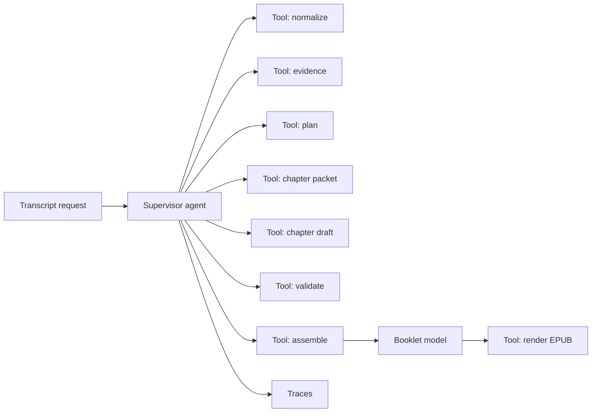
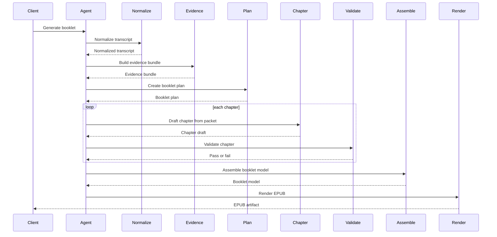

# Agentic Transcript to Booklet Methodology

Date: 2026-03-07
Status: Proposed alternative methodology
Scope: an agentic orchestration approach for transcript-to-booklet generation using the OpenAI Responses API plus Agents SDK or Codex-style workflows

## 1. Why This Doc Exists

One open question is whether we should keep hand-designing every orchestration step, or whether a model should decide more of the path to the final booklet.

This document describes a separate methodology:

- keep the result target fixed
- give an agent a bounded set of tools
- let the agent choose the order, retries, and some local decisions
- keep explicit schemas and deterministic render boundaries

This is not a proposal to abandon structure.
It is a proposal to move some orchestration logic from application code into a bounded agent loop.

## 2. Core Thesis

Recommended framing:

`agentic orchestration inside bounded contracts`

Not recommended:

`free-form autonomous agent with no fixed schemas`

That distinction matters.

If we let an agent directly improvise the whole pipeline without typed boundaries, we lose:

- auditability
- consistent quality
- debuggability
- renderer stability

If we let an agent operate through typed tools, we gain:

- adaptive planning
- simpler application code
- clearer experimentation
- traceable execution

## 3. Why OpenAI's Agent Stack Fits This Idea

Based on current OpenAI docs:

1. The Responses API is designed for agentic, tool-using, multi-turn workflows with stateful conversations.
2. The Agents SDK is the framework OpenAI positions for building and orchestrating workflows across multiple agents and tools.
3. OpenAI's Codex and Agents SDK cookbook examples emphasize traces, handoffs, tool calls, and observability for more complex workflows.

Relevant official references:

- Agents guide: https://developers.openai.com/api/docs/guides/agents/#how-to-build-an-agent
- Web search / tools guide: https://developers.openai.com/api/docs/guides/tools-web-search/
- Codex CLI and Agents SDK cookbook: https://developers.openai.com/cookbook/examples/codex/codex_mcp_agents_sdk/building_consistent_workflows_codex_cli_agents_sdk/
- Responses API reasoning and stateful turns cookbook: https://developers.openai.com/cookbook/examples/responses_api/reasoning_items/
- Agents SDK multi-agent cookbook: https://developers.openai.com/cookbook/examples/agents_sdk/multi-agent-portfolio-collaboration/multi_agent_portfolio_collaboration/

## 4. Recommended Method

Do not ask one agent to directly "write the ebook however it wants."

Instead, create one supervisor agent with a fixed tool belt.

Recommended tool set:

1. `normalize_transcript`
2. `build_evidence_bundle`
3. `create_booklet_plan`
4. `build_chapter_packet`
5. `draft_chapter`
6. `validate_chapter`
7. `assemble_booklet_model`
8. `render_epub`

The agent can decide:

- whether to re-run evidence extraction
- whether to revise the plan
- whether a weak chapter should be retried once
- whether some chapters can be drafted in parallel

The agent should not decide:

- the final renderer contract
- the schema of the core boundary objects
- whether unsupported facts or quotes are allowed

## 5. Proposed Workflow

### Diagram: Data Flow - Agentic Method

Diagram notes:

- What it shows: one supervising agent calling bounded tools instead of application code hard-coding every branch.
- Why it matters: orchestration becomes more flexible while the tool contracts stay stable.
- Important boundary: the render step still consumes a `BookletModel`, not free-form prose.

### Diagram: Sequence - Supervisor Driven Generation

Diagram notes:

- What it shows: the agent is the orchestrator, but the tools still return typed artifacts.
- Why it matters: this gives us a place to put adaptive retries and planning without making the renderer or data contracts fuzzy.
- Failure path: weak chapter output should trigger explicit retry or replanning, not silent generic filler.

## 6. What The Agent Should Remember

If we use the Responses API statefully, the agent can maintain continuity across steps.

But the system should still compact context aggressively.

The agent should carry forward:

- current booklet goal
- evidence bundle id or compact summary
- booklet plan
- chapter memory
- validation failures

The agent should not repeatedly carry forward:

- full raw transcript
- all prior chapter prose
- every intermediate artifact in raw form

In practice, this means:

1. use the transcript heavily in early steps
2. use compacted evidence and chapter memory in later steps
3. use typed tool outputs as the main memory surface

## 7. Best Use Cases For Agentic Orchestration

This method is a good fit when:

1. chapter count or structure may need adaptive replanning
2. transcripts vary a lot in quality and shape
3. we want to compare strategies without rewriting application control flow
4. we care about traces and post-run inspection

This method is a poor fit when:

1. we want fully predictable latency
2. we cannot tolerate orchestration variability
3. we do not have good tool schemas yet
4. we do not have observability into tool calls and handoffs

## 8. Recommended Architecture For This Repo

If we explore this path, the safest version is:

`one supervisor agent + fixed tools + typed outputs + deterministic renderer`

Recommended near-term implementation shape:

1. Keep the schema-boundary design from `docs/canonical-transcript-to-booklet-pipeline.md`.
2. Implement each stage as a callable tool with explicit input and output.
3. Let one agent decide the sequence of tool calls.
4. Capture traces for every run.
5. Keep EPUB rendering fully deterministic from `BookletModel`.

This keeps the methodology flexible while still making the product auditable.

## 9. Tradeoffs

Benefits:

- less application-side orchestration code
- easier experimentation with different flows
- adaptive retries and replanning
- strong observability if traces are enabled

Costs:

- more variable latency
- more variable token usage
- harder reproducibility than a rigid pipeline
- still requires good tool schemas

## 10. Recommendation

My recommendation is not:

- replace the schema-boundary work with a pure agentic workflow

My recommendation is:

- keep the schema-boundary PR as the product contract
- use this agentic methodology as a separate orchestration option on top of those schemas

In short:

`schemas first, agentic orchestration second`

That gives us the benefits of adaptive workflows without giving up stable interfaces.
