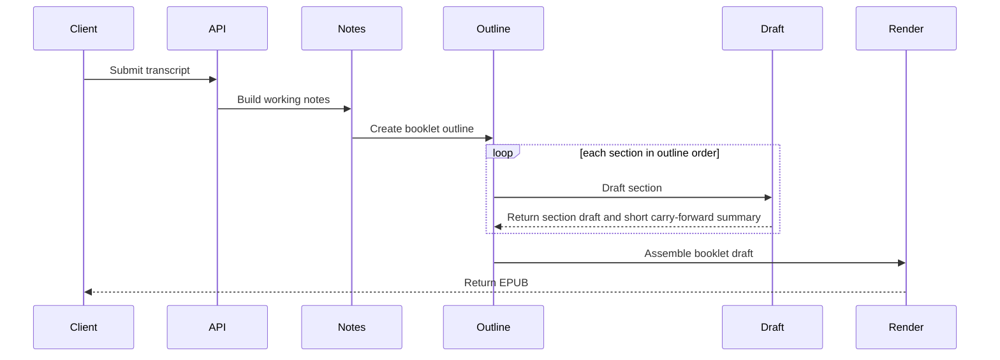
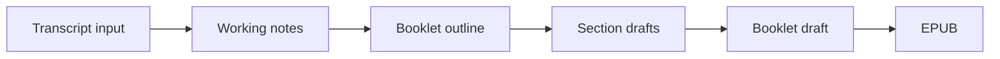

# Canonical Transcript to Booklet Pipeline

Date: 2026-03-07
Status: Proposed framing doc
Scope: define the minimum boundaries we actually know today, and leave the rest open on purpose

## 1. Why This Doc Exists

We already know how to render an EPUB.

The harder question is upstream:

- what should the generation pipeline look like
- what should stay flexible
- what should be fixed now versus learned later

This doc is intentionally narrower than a full architecture spec.
The goal is to avoid locking in abstractions before we have enough domain knowledge about transcripts, booklets, or ebook authoring.

## 2. What This Doc Does

This doc does three things:

1. define the minimum stage boundaries that seem useful today
2. define only the schemas we are confident about today
3. make the unresolved design questions explicit

This doc does not try to define a full internal ontology for:

- utterances
- support links
- theme ids
- segment ids
- chapter memory objects
- quote trace graphs

Those may become useful later, but they are not stable enough to standardize yet.

## 3. Working Assumptions

These are the assumptions this doc is willing to make:

1. The user gives us transcript text.
2. The system should produce a short, readable booklet-like artifact.
3. A table of contents or ordered section plan is probably useful before final prose.
4. Some intermediate machine-readable representation is useful between transcript and final booklet.
5. That intermediate representation should stay intentionally light until real usage proves what fields matter.

## 4. Minimum Pipeline

Recommended minimum flow:

`transcript input -> working notes -> booklet outline -> booklet draft -> EPUB`

Meaning:

- `transcript input`: the raw transcript and a small amount of metadata
- `working notes`: compact machine-readable notes derived from the transcript
- `booklet outline`: the ordered structure of the booklet before full prose is written
- `booklet draft`: the final structured booklet content that the renderer consumes
- `EPUB`: the rendered output artifact

The important point is not the names.
The important point is that we separate:

1. source material
2. internal compressed representation
3. book-shaped output
4. rendering

## 5. What Is Fixed Versus Open

Fixed in this doc:

- there should be an explicit transcript input boundary
- there should be an intermediate machine-readable stage
- there should be an outline or ordered section stage before final booklet prose
- the renderer should consume a final booklet-shaped object rather than raw transcript text

Still open:

- what exact fields belong in working notes
- how much traceability is worth carrying forward
- whether notes are chunk-based, summary-based, or something else
- whether sections are drafted strictly sequentially or with a later revise pass
- how much prior section context to feed forward
- what the best segmentation method is for long transcripts

## 6. Sequence Diagram



What this diagram is trying to show:

- the system should not jump directly from transcript to final ebook in one opaque step
- outline comes before full drafting
- later sections may use a compact summary of earlier sections
- the renderer is the last step, not the planning step

## 7. Data Flow Diagram



What this diagram is trying to show:

- each stage should hand off something inspectable
- the intermediate stages are allowed to evolve
- only the final booklet draft needs to be stable enough for rendering

## 8. Minimum Schemas We Can Defend Today

This section defines only the fields we seem able to justify right now.

### 8.1 Transcript Input

Purpose:

- capture the source transcript
- keep metadata optional unless clearly needed

```ts
type TranscriptInput = {
  transcript_text: string
  title?: string
  language?: string
  source?: string
}
```

Rules:

- `transcript_text` is required and non-empty
- all other fields are optional
- downstream logic should not require optional metadata to exist

### 8.2 Booklet Outline

Purpose:

- represent the planned order of the booklet before full prose is written
- keep this small and easy to change

```ts
type BookletOutline = {
  title?: string
  sections: {
    id: string
    heading: string
    goal?: string
  }[]
}
```

Rules:

- `sections` is required and must contain at least one section
- each section must have a stable `id` and human-readable `heading`
- `goal` is optional because we do not yet know whether every section needs one

### 8.3 Booklet Draft

Purpose:

- represent the final structured content before rendering

```ts
type BookletDraft = {
  title: string
  sections: {
    id: string
    heading: string
    body: string
  }[]
}
```

Rules:

- `title` is required and non-empty
- `sections` is required and must contain at least one section
- each section must have prose in `body`
- the renderer should only depend on this object, not on earlier internal notes

### 8.4 Render Artifact

Purpose:

- describe the generated output file

```ts
type RenderArtifact = {
  format: "epub"
  file_name: string
  location: string
}
```

Rules:

- this is the renderer output boundary, not the generation boundary
- renderer-specific details should stay here rather than leaking back into drafting

## 9. Intentionally Unspecified: Working Notes

`Working notes` are useful as a concept, but under-specified as a schema.

For now, the only strong requirements are:

1. they must come from the transcript
2. they must be machine-readable
3. they must be compact enough to help later drafting
4. they must be inspectable during debugging
5. they should be easy to change as we learn what matters

That means this doc does not yet define a full `WorkingNotes` type.

This is deliberate.
It prevents us from standardizing fields like `utterance_ids`, `theme_ids`, or `support` references before we know they earn their keep.

## 10. Questions This PR Is Trying To Set Up

This doc is mainly trying to make the next questions easier to answer:

1. What should working notes actually contain?
2. How much context does section drafting need from prior sections?
3. Should section drafting be strictly sequential, or parallel plus revise?
4. How should long transcripts be compacted before outlining and drafting?
5. Which fields are truly needed for quality, versus just feeling rigorous?

## 11. Recommended Next PRs

Instead of one large architecture PR, split the work:

1. `pipeline framing`
This PR.
Keep it minimal and avoid locking internal details too early.

2. `working notes experiments`
Try two or three lightweight note formats against real transcripts.
Compare usefulness, not elegance.

3. `outline and drafting policy`
Decide how section ordering, carry-forward context, and final assembly should work.

4. `evaluation and observability`
Once the stages are simpler, add inspection and comparison around the real boundaries.

## 12. Success Criteria For This Doc

This doc is successful if it helps the team agree on:

- the minimum number of stages worth keeping
- which boundaries should be explicit
- which assumptions should remain open

This doc is not successful if it makes us feel precise while baking in details we do not yet understand.
