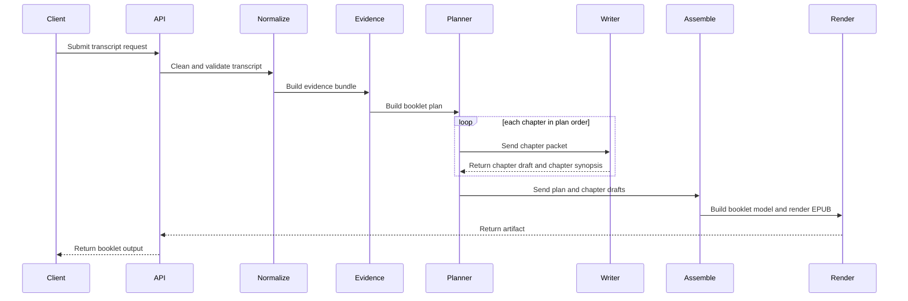

# Canonical Transcript to Booklet Pipeline

Date: 2026-03-07
Status: Proposed decision doc
Scope: transcript input to booklet output, including the internal schemas passed between stages

## 1. Why This Doc Exists

The project already knows how to turn transcripts into EPUB files.

The missing decision is not "can we render an EPUB?"
The missing decision is "what is the canonical pipeline and what exact object moves from one stage to the next?"

This document defines that pipeline.

It is intentionally strict about boundaries so future implementation PRs can answer a simple question:

- does this change move the code toward the agreed pipeline?

## 2. Decision Summary

Recommended canonical flow:

`transcript -> evidence bundle -> booklet plan -> chapter packets -> chapter drafts -> booklet model -> EPUB`

Key decisions:

1. The system should not go straight from raw transcript to final chapter prose in one opaque step.
2. The first stable internal representation should be an evidence-oriented object, not an EPUB-oriented object.
3. The renderer should only consume the final `BookletModel`.
4. Chapter drafting should be sequential by default, with compact memory passed forward from earlier chapters.
5. Long-transcript segmentation should exist to control context size and preserve evidence quality, not to preemptively force a writing structure.

## 3. Terms

- `Evidence bundle`: the compressed, structured truth extracted from the transcript.
- `Booklet plan`: the global structure of the booklet before chapter prose is written.
- `Chapter packet`: the exact input given to the model when drafting one chapter.
- `Chapter memory`: compact carry-forward memory from earlier drafted chapters.
- `Booklet model`: the final structured booklet object used by renderers.

`Booklet` in this repo means a short, structured reading artifact made from a transcript.
It is more readable than notes and less ambitious than a full literary book.

## 4. Pipeline Overview

### Diagram: Data Flow - Canonical Pipeline


Diagram notes:

- What it shows: the canonical stage boundaries and the main objects that move through the system.
- Why it matters: the key boundary is `evidence bundle` to `booklet plan`, then `chapter packet` to `chapter draft`.
- Important loop: `chapter memory` feeds later chapters so the writer stays coherent without needing the full transcript every time.

### Diagram: Sequence - End to End Generation



Diagram notes:

- What it shows: the control flow from request to rendered booklet.
- Why it matters: planning happens before writing, and chapter writing happens with bounded local context.
- Failure path: if chapter drafting fails, the system should fail loudly or retry under explicit policy; it should not silently invent hidden fallback content.

## 5. Stage Boundaries and Schemas

This section defines the canonical object at each boundary.

## 5.1 Transcript Request

Purpose:

- capture the source text and minimum metadata
- provide the one input contract at the API boundary

Required properties:

- `request_id`
- `title`
- `language`
- `transcript_text`
- `source_ref`
- `compliance`

Schema example:

```json
{
  "request_id": "run_123",
  "title": "Episode Title",
  "language": "zh-CN",
  "transcript_text": "raw transcript string",
  "source_ref": "https://example.com/episode",
  "metadata": {
    "podcast_name": "Podcast Name",
    "episode_number": "258"
  },
  "compliance": {
    "for_personal_or_authorized_use_only": true,
    "no_commercial_use": true
  }
}
```

Boundary rule:

- downstream stages may normalize the transcript, but may not silently change source meaning

## 5.2 Evidence Bundle

Purpose:

- convert the transcript into a compact, inspectable truth layer
- preserve evidence needed for later writing without carrying the whole transcript forever

This is the first major internal representation.

Required properties:

- `meta`
- `segments`
- `entities`
- `themes`
- `candidate_quotes`
- `global_summary`

Schema example:

```json
{
  "meta": {
    "request_id": "run_123",
    "title": "Episode Title",
    "language": "zh-CN",
    "source_ref": "https://example.com/episode"
  },
  "global_summary": {
    "one_line_topic": "本期围绕亲密关系中的边界展开。",
    "source_profile": "discussion",
    "estimated_reading_goal": "booklet"
  },
  "segments": [
    {
      "segment_id": "seg_01",
      "range": "00:00 - 08:24",
      "speaker_mix": ["Host", "Guest A"],
      "summary_points": [
        "先定义关系中的边界。",
        "讨论为什么很多冲突不是恶意而是误解。"
      ],
      "claims": [
        {
          "claim_id": "cl_01",
          "text": "边界不是冷漠，而是帮助关系更稳定。",
          "support": ["utt_014", "utt_018"]
        }
      ],
      "candidate_quotes": [
        {
          "quote_id": "q_01",
          "speaker": "Guest A",
          "timestamp": "04:32",
          "text": "边界不是推开别人，而是先知道自己在哪里。",
          "source_ids": ["utt_018"]
        }
      ],
      "utterance_ids": ["utt_001", "utt_002", "utt_018"]
    }
  ],
  "entities": [
    {
      "name": "边界",
      "kind": "concept",
      "mentions": ["utt_014", "utt_018", "utt_052"]
    }
  ],
  "themes": [
    {
      "theme_id": "theme_01",
      "label": "边界与误解",
      "segment_ids": ["seg_01", "seg_02"]
    }
  ],
  "candidate_quotes": [
    {
      "quote_id": "q_09",
      "speaker": "Host",
      "timestamp": "21:18",
      "text": "关系最怕的不是争执，而是不知道彼此在争什么。",
      "source_ids": ["utt_091"]
    }
  ]
}
```

Boundary rules:

- every quote in later stages should trace back to this bundle
- later writing stages can compress or reorder, but should not invent unsupported quotes or claims

## 5.3 Booklet Plan

Purpose:

- define the global structure before drafting chapters
- decide what the booklet is trying to say, in what order, and why

Required properties:

- `booklet_title`
- `booklet_thesis`
- `target_reader`
- `table_of_contents`
- `chapter_order`
- `global_constraints`

Schema example:

```json
{
  "booklet_title": "关系里的边界，不是冷漠",
  "booklet_thesis": "这期内容的核心，是把边界从拒绝别人，重新理解成稳定关系的前提。",
  "target_reader": "希望把播客内容快速整理成可读短书的读者",
  "tone": "clear, warm, concise",
  "chapter_order": ["ch_01", "ch_02"],
  "table_of_contents": [
    {
      "chapter_index": 1,
      "chapter_id": "ch_01",
      "title": "先把边界说清楚",
      "goal": "定义概念，避免一开始就把边界理解成疏离。",
      "segment_ids": ["seg_01"],
      "depends_on": []
    },
    {
      "chapter_index": 2,
      "chapter_id": "ch_02",
      "title": "很多冲突其实来自误解",
      "goal": "解释为什么关系冲突经常不是恶意，而是边界不清。",
      "segment_ids": ["seg_02", "seg_03"],
      "depends_on": ["ch_01"]
    }
  ],
  "global_constraints": {
    "max_chapters": 7,
    "must_use_evidence_quotes": true,
    "avoid_repetition": true,
    "language": "zh-CN"
  },
  "terms_to_define": ["边界", "误解", "请求"],
  "closing_goal": "给读者一个可执行的关系观察框架。"
}
```

Boundary rules:

- the plan can change structure, but it cannot fabricate source evidence
- chapter order is fixed before drafting starts unless a later explicit replanning step is added

## 5.4 Chapter Memory

Purpose:

- carry forward compact continuity information from earlier chapters
- keep later chapters coherent without reloading the full transcript

This object exists because chapter 3 should know what chapter 1 and 2 already established.

Required properties:

- `prior_chapter_synopses`
- `locked_terms`
- `resolved_claims`
- `avoid_repetition_notes`

Schema example:

```json
{
  "prior_chapter_synopses": [
    {
      "chapter_id": "ch_01",
      "title": "先把边界说清楚",
      "synopsis": "本章先把边界定义为关系中的自我界限，而不是拒绝别人。"
    },
    {
      "chapter_id": "ch_02",
      "title": "很多冲突其实来自误解",
      "synopsis": "本章说明冲突常来自双方对需求和限制的理解不同。"
    }
  ],
  "locked_terms": [
    {
      "term": "边界",
      "definition": "关系里清楚表达自己能接受和不能接受的范围。"
    }
  ],
  "resolved_claims": [
    "边界不是冷漠",
    "误解比恶意更常见"
  ],
  "avoid_repetition_notes": [
    "不要重复整段定义",
    "不要再次使用同一条主引语作为本章核心"
  ]
}
```

Boundary rules:

- chapter memory should stay compact
- chapter memory should contain summaries and decisions, not whole earlier chapters

## 5.5 Chapter Packet

Purpose:

- define the exact bounded context used to draft one chapter
- combine the global plan, local evidence, and chapter memory

Required properties:

- `chapter_brief`
- `source_evidence`
- `chapter_memory`
- `style_constraints`

Schema example:

```json
{
  "chapter_brief": {
    "chapter_id": "ch_03",
    "chapter_index": 3,
    "title": "请求比情绪更能推进对话",
    "goal": "从边界和误解过渡到更具体的沟通动作。",
    "target_range": "18:10 - 29:44",
    "depends_on": ["ch_01", "ch_02"]
  },
  "source_evidence": {
    "segment_ids": ["seg_04", "seg_05"],
    "summary_points": [
      "情绪本身不能直接告诉对方你需要什么。",
      "把感受转成请求，才更可能让关系往前走。"
    ],
    "candidate_quotes": [
      {
        "speaker": "Guest B",
        "timestamp": "22:19",
        "text": "你如果只表达委屈，对方未必知道你到底希望什么。"
      }
    ]
  },
  "chapter_memory": {
    "prior_chapter_synopses": [
      {
        "chapter_id": "ch_01",
        "synopsis": "已定义边界。"
      },
      {
        "chapter_id": "ch_02",
        "synopsis": "已解释误解如何制造冲突。"
      }
    ],
    "locked_terms": [
      {
        "term": "边界",
        "definition": "关系里清楚表达自己能接受和不能接受的范围。"
      }
    ]
  },
  "style_constraints": {
    "language": "zh-CN",
    "voice": "clear and grounded",
    "max_quotes": 4,
    "max_summary_points": 5
  }
}
```

Boundary rules:

- chapter drafting should only use this packet, not the whole transcript
- if the packet is too weak, the system should enrich the evidence bundle or revise the plan, not hide the weakness with generic prose

## 5.6 Chapter Draft

Purpose:

- hold the structured result of writing one chapter
- stay evidence-aware and easy to validate before full-book assembly

Required properties:

- `title`
- `summary`
- `quotes`
- `insights`
- `actions`
- `chapter_synopsis`

Schema example:

```json
{
  "chapter_id": "ch_03",
  "title": "请求比情绪更能推进对话",
  "range": "18:10 - 29:44",
  "summary": [
    "情绪能提示问题，但不能替代请求。",
    "把感受转成可回应的表达，才更容易推动关系。"
  ],
  "quotes": [
    {
      "speaker": "Guest B",
      "timestamp": "22:19",
      "text": "你如果只表达委屈，对方未必知道你到底希望什么。",
      "quote_id": "q_14"
    }
  ],
  "insights": [
    "沟通失败常常不是不在乎，而是不知道应该回应什么。"
  ],
  "actions": [
    "下次感到委屈时，先把情绪翻译成一个具体请求。"
  ],
  "chapter_synopsis": "本章把前面的边界和误解，推进到更具体的请求表达。"
}
```

Boundary rules:

- every quote should resolve back to the evidence bundle
- every chapter draft should produce a short `chapter_synopsis` for later memory

## 5.7 Booklet Model

Purpose:

- define the final canonical content contract consumed by EPUB, PDF, or Markdown renderers

This is the render boundary.

Required properties:

- `meta`
- `summary`
- `table_of_contents`
- `chapters`
- `terms`
- `closing`

Schema example:

```json
{
  "meta": {
    "identifier": "urn:booklet:run_123",
    "title": "关系里的边界，不是冷漠",
    "language": "zh-CN",
    "source_type": "transcript",
    "source_ref": "https://example.com/episode",
    "generated_at": "2026-03-07T12:00:00.000Z"
  },
  "summary": {
    "one_line_conclusion": "这本 booklet 的核心，是把边界理解成稳定关系的前提。",
    "tldr": [
      "边界不是冷漠。",
      "很多冲突来自误解而不是恶意。",
      "把感受变成请求，比反复表达情绪更有用。"
    ]
  },
  "table_of_contents": [
    {
      "chapter_id": "ch_01",
      "title": "先把边界说清楚",
      "range": "00:00 - 08:24"
    },
    {
      "chapter_id": "ch_02",
      "title": "很多冲突其实来自误解",
      "range": "08:25 - 18:09"
    }
  ],
  "chapters": [
    {
      "chapter_id": "ch_01",
      "title": "先把边界说清楚",
      "range": "00:00 - 08:24",
      "summary": ["边界是关系中的界限，不是疏离。"],
      "quotes": [
        {
          "speaker": "Guest A",
          "timestamp": "04:32",
          "text": "边界不是推开别人，而是先知道自己在哪里。"
        }
      ],
      "insights": ["边界感清楚，关系才更稳定。"],
      "actions": ["先写下自己最需要被尊重的一条界限。"]
    }
  ],
  "terms": [
    {
      "term": "边界",
      "definition": "关系里清楚表达自己能接受和不能接受的范围。"
    }
  ],
  "closing": {
    "final_takeaway": "比起让关系更和谐，先让边界更清楚，通常更有效。"
  }
}
```

Boundary rules:

- the renderer should not need the transcript, evidence bundle, or booklet plan
- all renderers should derive from this same object

## 5.8 Render Artifact Manifest

Purpose:

- define what the generation run returns after rendering

Schema example:

```json
{
  "request_id": "run_123",
  "artifacts": [
    {
      "type": "epub",
      "file_name": "run_123.epub",
      "download_url": "https://example.com/downloads/run_123.epub",
      "size_bytes": 183920
    }
  ],
  "traceability": {
    "source_type": "transcript",
    "source_ref": "https://example.com/episode",
    "booklet_identifier": "urn:booklet:run_123"
  }
}
```

Boundary rule:

- returned artifacts should be derived from the final `BookletModel`, not from side-channel templates or alternate content objects

## 6. Context Policy

This section answers the practical question: how does chapter 3 stay coherent with chapter 1 and 2?

Recommended policy:

1. Do not rely on one giant context window as the primary coherence strategy.
2. Treat very large contexts as a red zone, not a target.
3. Keep chapter-writing context bounded through `ChapterPacket` plus `ChapterMemory`.

Recommended use of context:

- planning call:
  - evidence bundle
  - no final prose yet
- chapter writing call:
  - one `ChapterPacket`
  - local source evidence
  - compact memory from earlier chapters
- final assembly:
  - structured chapter drafts only

This means the system keeps coherence by carrying forward:

- chapter synopses
- locked term definitions
- resolved claims
- anti-repetition notes

Not by repeatedly sending the entire transcript and all prior prose.

## 7. What This Defers

This document intentionally does not settle:

1. fixed chunk vs sliding window vs semantic chunking as an implementation choice
2. model choice
3. exact prompt wording
4. visual experimentation UI
5. automated scoring thresholds

Those decisions should come after the canonical pipeline and schemas are agreed.

## 8. Recommended Implementation Order

1. Define code-level types for each boundary object in the backend.
2. Make the pipeline emit these objects in inspector output, even before every stage is fully model-driven.
3. Make renderers consume only `BookletModel`.
4. Evaluate segmentation strategies based on which one produces the strongest `EvidenceBundle`, not on which one feels most architecturally elegant.

## 9. Success Criteria

This design is successful if:

1. a reviewer can point to one object at each stage and say what it means
2. chapter drafting can stay coherent without loading the whole transcript every time
3. EPUB rendering can happen from `BookletModel` only
4. future PRs can modify one stage without redefining the whole pipeline
