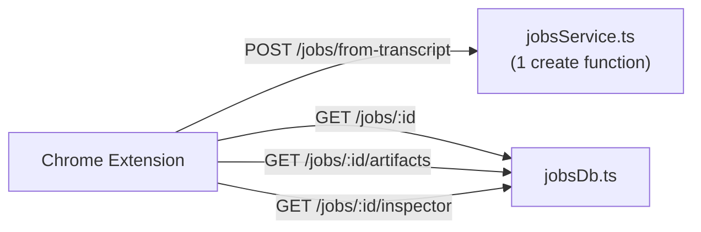
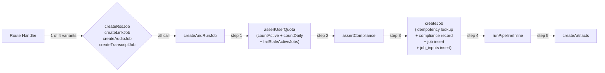
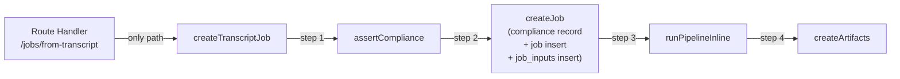
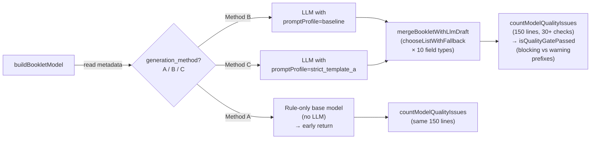
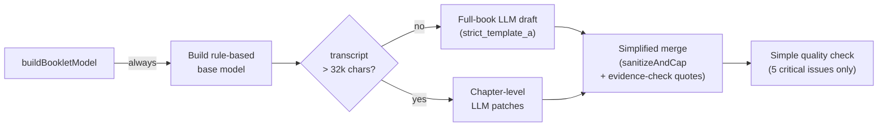
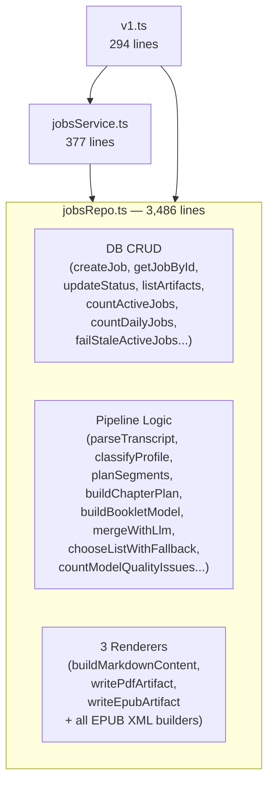
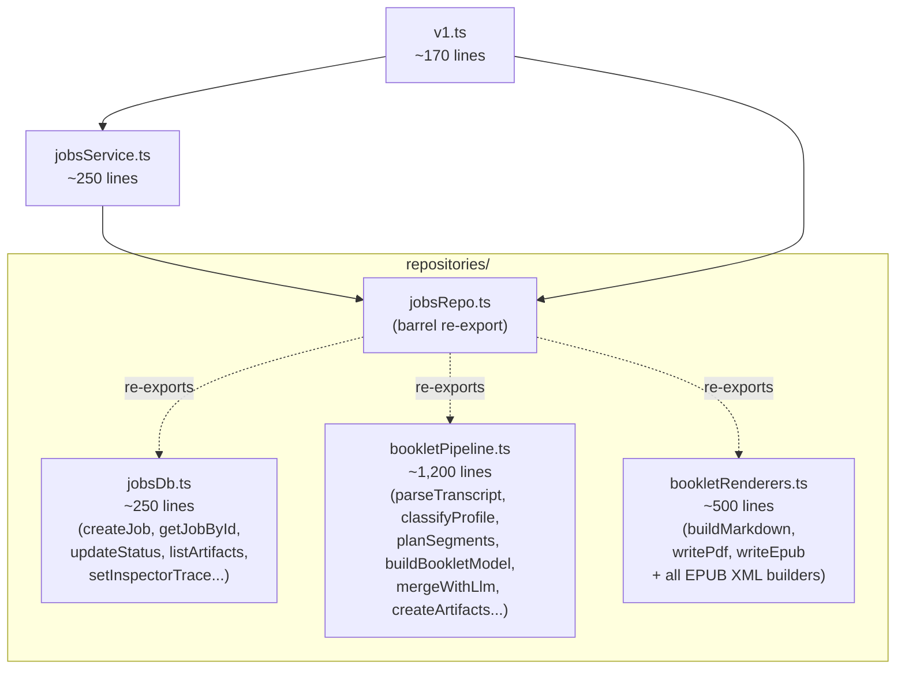
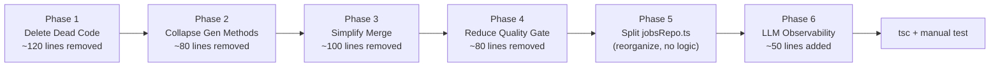

# Simplify Backend Pipeline — Plan Doc

**Status:** Draft
**Author:** Claude (paired with Leo)
**Date:** 2026-03-04

---

## TL;DR

The backend was built by a contractor as a multi-user SaaS but is used by **one non-technical person (Cecilia)**. `jobsRepo.ts` is 3,486 lines mixing DB CRUD, pipeline logic, and 3 renderers. Quota systems, stub endpoints, multiple generation methods, and idempotency infrastructure serve nobody.

**Goal:** Cut ~380 lines of dead code, collapse branching logic, simplify the merge/quality layers, split the god-file into 3 focused modules, and add better LLM observability. The Chrome extension UX and API contract stay identical.

**Net result:** ~4,735 lines across 4 files → ~3,200 lines across 6 files, with cleaner separation of concerns.

---

## 1. API Surface — Before vs After

### Before: 8 routes, 4 job-creation endpoints

```mermaid
flowchart LR
  EXT["Chrome Extension"] -->|POST /jobs/from-transcript| SVC["jobsService.ts\n(4 create functions)"]
  EXT -->|POST /jobs/from-rss| SVC
  EXT -->|POST /jobs/from-link| SVC
  EXT -->|POST /jobs/from-audio\n(multipart upload)| SVC
  EXT -->|POST /rss/parse| SVC
  EXT -->|GET /jobs/:id| REPO["jobsRepo.ts\n(3,486 lines)"]
  EXT -->|GET /jobs/:id/artifacts| REPO
  EXT -->|GET /jobs/:id/inspector| REPO
```

> **Summary:** The extension only uses `/jobs/from-transcript`. The RSS, link, audio routes, and RSS parse stub are dead code — they were built for a future that never shipped.

### After: 4 routes, 1 job-creation endpoint



> **Summary:** Only the transcript endpoint survives. Multer upload middleware is removed entirely.

### What's deleted from `v1.ts`

| Route | Why dead |
|-------|----------|
| `POST /jobs/from-rss` | Never called by extension, RSS ingestion never built |
| `POST /jobs/from-link` | Never called, link scraping never built |
| `POST /jobs/from-audio` | Never called, audio transcription never built |
| `POST /rss/parse` | Stub returning hardcoded fake data |
| `createFromRssSchema` | Zod schema for dead route |
| `createFromLinkSchema` | Zod schema for dead route |
| `rssParseSchema` | Zod schema for dead route |
| `multer` setup | Only needed for audio upload |
| `parseMaybeJson()` | Only needed for multipart form parsing |
| `requestMeta()` | Feeds idempotency/IP/UA — no longer needed |

---

## 2. Job Creation Flow — Before vs After

### Before: Quota checks, 4 entry points, idempotency



> **Summary:** Every job goes through quota counting (3 DB queries), an idempotency key lookup, and one of 4 wrapper functions that all funnel into the same `createAndRunJob`. Only the transcript path is ever used.

### After: Direct path, no quota, no idempotency



> **Summary:** One user, no quota needed. No idempotency key used by the extension. Three DB queries eliminated per job creation.

### What's deleted from `jobsService.ts`

| Symbol | Lines | Why dead |
|--------|-------|----------|
| `createRssJob()` | ~26 | Dead route |
| `createLinkJob()` | ~24 | Dead route |
| `createAudioJob()` | ~38 | Dead route |
| `assertUserQuota()` | ~16 | Single user, no quota needed |
| `readGenerationMethod()` | ~6 | Generation method collapsed (Phase 2) |
| `MAX_AUDIO_BYTES` | 1 | Dead constant |
| `MAX_AUDIO_SECONDS` | 1 | Dead constant |
| `MAX_ACTIVE_JOBS_PER_USER` | 1 | Dead constant |
| `MAX_DAILY_JOBS_PER_USER` | 1 | Dead constant |
| `ACTIVE_JOB_STALE_TIMEOUT_MINUTES` | 1 | Dead constant |
| `requestIp`, `userAgent`, `idempotencyKey` params | scattered | Removed from function signatures |

### What's deleted from `jobsRepo.ts`

| Symbol | Lines | Why dead |
|--------|-------|----------|
| `countActiveJobs()` | ~9 | Quota removed |
| `countDailyJobs()` | ~9 | Quota removed |
| `failStaleActiveJobs()` | ~14 | Quota removed |
| Idempotency block in `createJob()` | ~16 | Never used by extension |

`getServiceLimits()` in jobsService.ts is also simplified — it drops the audio/quota fields but keeps `maxTranscriptChars` since that's real validation.

---

## 3. Generation Pipeline — Before vs After

This is the most complex change. The current pipeline has 3 generation methods (A/B/C), a complex merge layer with fallback chains, and a 150-line quality gate.

### Before: 3 methods, complex branching



> **Summary:** Three generation methods create three code paths through the pipeline. Method A returns the rule-based model directly (low quality, mostly useless). Methods B and C both go through LLM but with different prompt profiles. The merge layer uses `chooseListWithFallback` which has a 4-step preference chain (preferred → fallback → merged dedup → factory fallback) for every single field.

### After: Single path, always strict_template_a



> **Summary:** One path. The rule base always gets built, then the LLM always runs with `strict_template_a` (the higher-quality prompt). The only branching is the existing `forceChapterPath` for long transcripts (a real edge case, not dead code). Merge is simplified, quality gate checks only what matters for EPUB validity.

### Deep dive: What changes in the merge layer

**Before — `chooseListWithFallback(preferred, fallback, count, maxLength, fallbackFactory)`:**

```
1. Clean + dedup `preferred` items → take up to `count`
2. Clean + dedup `fallback` items → take up to `count`
3. Merge preferred + fallback → dedup → take up to `count`
4. If still empty and `fallbackFactory` exists → generate synthetic items
```

This runs **10 times** per model (suitableFor, outcomes, tldr, chapterPoints, chapterQuotes, chapterActions, actionNow, actionWeek, actionLong, terms). The fallback chain is defensive coding for the Method A path where LLM might not exist — but we're always running the LLM now.

**After — `sanitizeAndCap(items, maxCount, maxLength)`:**

```
1. Clean + dedup items → take up to maxCount, cap length
```

That's it. The LLM output is used directly (after sanitizing). For quotes specifically, evidence-checking is preserved because it's the one genuinely valuable hallucination guard.

### Deep dive: What changes in the quality gate

**Before — `countModelQualityIssues()` (150 lines, 30+ checks):**

Checks things like: chapter section IDs match expected format, appendix theme count ≥ 2, appendix theme names ≥ 2 chars, suitable_for count, outcomes count, TL;DR length range, terms count, total actions count, unresolved template tokens, meta creator present, meta source ref present, template section count in range, date/ISO mismatches, etc.

Then `isQualityGatePassed()` classifies each issue as "blocking" (12 prefixes) or "warning" (10 prefixes), and the gate fails if any blocking issue exists OR warnings exceed 4.

**After — simple inline check (~20 lines):**

```typescript
function checkModelQuality(model: BookletModel): { issues: string[]; passed: boolean } {
  const issues: string[] = [];
  if (!model.chapters.length) issues.push("no_chapters");
  if (model.chapters.length < 5 || model.chapters.length > 7)
    issues.push(`chapter_count_out_of_range:${model.chapters.length}`);
  for (const ch of model.chapters) {
    if (!ch.title || ch.title.length < 2) issues.push(`chapter_title_too_short:${ch.index}`);
  }
  if (!model.meta.identifier?.startsWith("urn:booklet:")) issues.push("meta_identifier_invalid");
  if (!model.meta.language) issues.push("meta_language_missing");
  return { issues, passed: issues.length === 0 };
}
```

**Why only these 5?**

| Check | Why kept |
|-------|----------|
| `no_chapters` | Empty EPUB = broken file |
| `chapter_count_out_of_range` | EPUB nav breaks with wrong chapter count |
| `chapter_title_too_short` | EPUB nav shows blank entries |
| `meta_identifier_invalid` | EPUB `content.opf` requires valid identifier |
| `meta_language_missing` | EPUB XML `lang` attribute required |

Everything else was either: (a) checking LLM output quality that the LLM consistently gets right with `strict_template_a`, or (b) checking template/section IDs that are deterministically generated by the rule base and can never be wrong.

---

## 4. File Structure — Before vs After

### Before: God-file



> **Summary:** Everything lives in one file. The renderers have zero coupling to the DB — they take a `BookletModel` and produce bytes — but they're mixed in with DB queries and pipeline orchestration.

### After: 3 focused modules + barrel



> **Summary:** DB operations, pipeline logic, and renderers each get their own file. `jobsRepo.ts` becomes a barrel `export * from` the three files, so all existing imports keep working without changes.

### Splitting rules

| Destination | What goes there | Key principle |
|-------------|----------------|---------------|
| `jobsDb.ts` | `createJob`, `getJobById`, `getJobByIdAny`, `updateJobStatusAndStage`, `listArtifacts`, `getJobInputByJobId`, `setJobInspectorTrace`, `getJobInspectorTrace`, `getArtifactForDownload`, `withTransaction`, `mapJobRow` | Pure DB I/O — takes params, returns rows |
| `bookletPipeline.ts` | All parsing, profiling, segmenting, planning, model building, LLM merge, evidence checking, `createArtifacts` (orchestrator) | Core business logic — takes transcript text, produces `BookletModel` |
| `bookletRenderers.ts` | `buildMarkdownContent`, `writePdfArtifact`, `writeEpubArtifact`, all EPUB XML builders, PDF helpers, `prepareArtifactFile` | Pure rendering — takes `BookletModel`, produces bytes |

`createArtifacts` goes to `bookletPipeline.ts` because it orchestrates: build model → render formats → insert DB rows. It imports from both `jobsDb.ts` and `bookletRenderers.ts`.

---

## 5. LLM Observability Improvements (Phase 6)

This phase adds ~50 lines, not removes. It makes debugging easier when Cecilia reports a bad output.

### What's added to `bookletLlm.ts`

| Field | Where | Purpose |
|-------|-------|---------|
| `promptTokenEstimate` | Inspector `llm_request` stage | `Math.ceil(prompt.length / 4)` — rough token count so we know if we're near model limits |
| Response preview increased | `rawContentPreview` | 5,000 → 20,000 chars — currently truncates before we can see what went wrong |
| `parseErrors` | Inspector `llm_response` stage | When JSON parsing fails, capture the actual error message |

### What's added to `bookletPipeline.ts`

| Field | Where | Purpose |
|-------|-------|---------|
| `chapter_plan_summary` | Inspector `llm_request` stage | Array of `{index, title, range}` — see what the chapter planner decided before LLM runs |
| `transcript_char_count` | Inspector data | Know the input size without opening the raw transcript |
| `transcript_entry_count` | Inspector data | Know how many parsed entries the transcript produced |

---

## 6. Risk Assessment

| Risk | Mitigation |
|------|-----------|
| Removing Method A breaks some edge case | Method A was the low-quality rule-only path. The LLM path (B/C) always produces better output. If LLM fails, the chapter-level patch retry still runs. If that also fails, the rule base is still there as the merge base. |
| Simplified quality gate misses a real issue | The 5 remaining checks cover EPUB structural validity. The other 25+ checks were about content quality (sparse points, few terms, etc.) which the LLM consistently handles well with strict_template_a. |
| Removing quota allows runaway jobs | Single user. If needed later, add a simple rate limit at the nginx/reverse proxy level. |
| File split breaks imports | Barrel re-export from `jobsRepo.ts` means zero import changes needed anywhere. |
| Removing idempotency causes duplicate jobs | The extension doesn't send idempotency keys. The DB columns stay (nullable), just the lookup logic is removed. |

---

## 7. Phase Execution Order



> **Summary:** Each phase is independently testable. Phases 1-4 are pure deletion/simplification. Phase 5 is file reorganization with no logic changes. Phase 6 adds the only new code. Total net: ~330 lines removed.

Phases must be sequential — each builds on the previous. Phase 5 especially needs Phases 1-4 done first so it's splitting a cleaner file.
