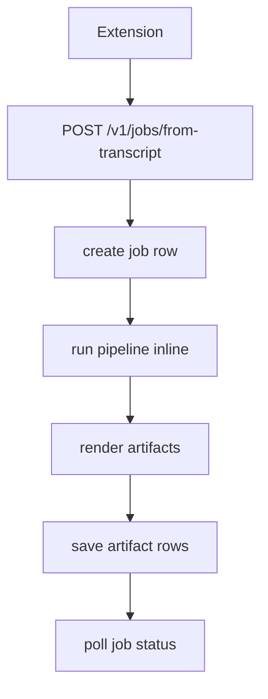
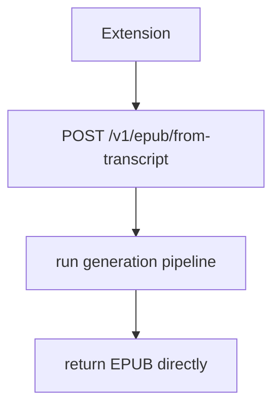
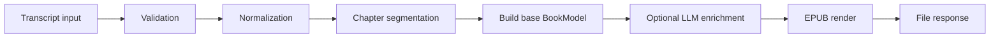

# Simplify Backend Plan (Single-User Transcript -> EPUB)

**Status:** Proposed rewrite
**Date:** 2026-03-04

## Why This Exists

The product is a Chrome extension used by one person to turn transcripts into EPUBs.

So our architecture should optimize for:

1. Correct output.
2. Fast debugging.
3. Low moving-part count.

Not for queue throughput, multi-tenant quotas, or infrastructure flexibility.

## Highest-Level Architecture Decision

We should not run a message queue.

We should phase out "job" as the central abstraction and move to a direct generation request.

### Current mental model



### Target mental model



Optional: log one `runs` record for debugging/audit, but no queue semantics (`queued`, `processing`, worker retries).

## Do We Need Jobs?

Ranked options:

1. **No jobs (recommended now)**
- Best for single-user simplicity.
- Fewer failure modes.
- Direct request/response mental model.

2. **Minimal runs table (optional later)**
- Keep history without queue machinery.
- Useful if user wants "last 10 generated books" in UI.

3. **Full jobs + queue (not now)**
- Only worth it for multi-user concurrency, worker autoscaling, and durable retries.

## Transcript -> EPUB Pipeline



### Stage meanings

- **Validation:** length, required fields, compliance.
- **Normalization:** clean transcript markers, speaker labels, timestamp noise.
- **Segmentation:** map transcript into chapter chunks.
- **BookModel:** one canonical in-memory structure for title/chapters/sections.
- **LLM enrichment:** optional rewrite/expansion under strict JSON contract.
- **EPUB render:** build `content.opf`, nav/toc, chapter XHTML, zip package.

## What To Remove First

1. Remove unused ingestion routes (`from-rss`, `from-link`, `from-audio`, `rss/parse`).
2. Remove quota/idempotency checks that are not used by extension workflow.
3. Collapse generation method fan-out (`A/B/C`) to one default path.
4. Keep only EPUB as default output in extension UX.
5. Remove silent fallback behavior for LLM failures.

## Migration Plan (Small, Safe Steps)

### Phase 1: API simplification

- Keep existing transcript endpoint but mark legacy endpoints deprecated in docs.
- Add `POST /v1/epub/from-transcript` wrapper (can call current pipeline initially).

### Phase 2: Service simplification

- Inline single transcript path.
- Delete dead create-job variants and dead validation branches.

### Phase 3: Data model simplification

- Replace job-first assumptions with optional `runs` record.
- Stop modeling queue state when no queue exists.

### Phase 4: UI simplification

- Replace polling-based status UI with direct generation + download flow.
- Keep inspector only as optional expandable debug panel.

## Failure Policy (Important)

- Fail loudly when primary path breaks.
- Do not hide failures behind automatic behavior that masks root causes.
- If LLM is enabled and request fails, return explicit error to UI.

## Out Of Scope (For Now)

- Multi-user concurrency controls.
- Worker autoscaling.
- Queue-based retries.
- Complex feature flags for generation methods.

## Before/After Regression Check (Required Each Phase)

Run this test immediately before and after each simplification phase:

```bash
BASE_URL=http://localhost:8080 ./scripts/regression-transcript-flow.sh
```

What it verifies:

1. `POST /v1/jobs/from-transcript` accepts request and returns `job_id`.
2. `GET /v1/jobs/{id}` eventually reaches `succeeded`.
3. `GET /v1/jobs/{id}/artifacts` returns at least one artifact and includes `epub`.
4. First artifact `download_url` is fetchable.
5. `GET /v1/jobs/{id}/inspector` includes `transcript` and `normalization` stages.

If this regression check fails after any phase, stop and fix the phase before continuing.

## Success Criteria

1. User can paste transcript and get EPUB in one flow.
2. No queue terminology in core path.
3. Fewer moving parts in route/service/repository layers.
4. Failure reasons are explicit and visible.
