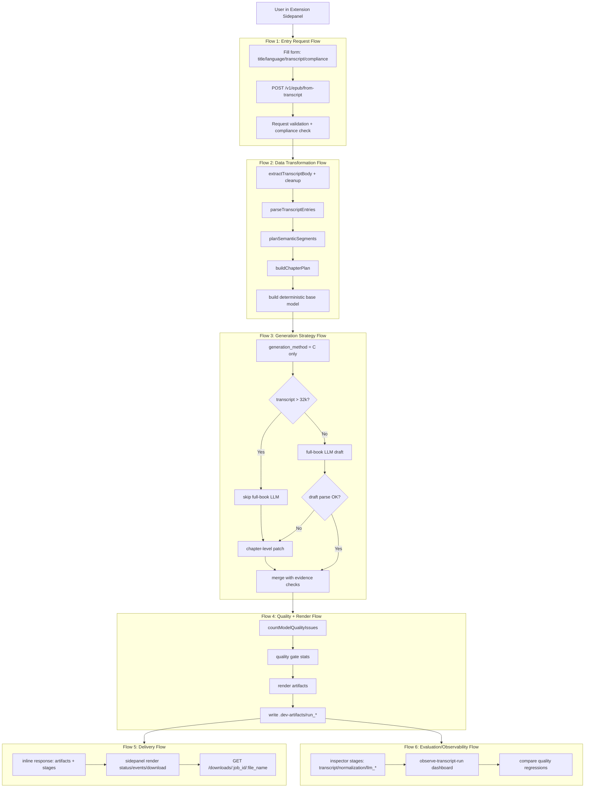
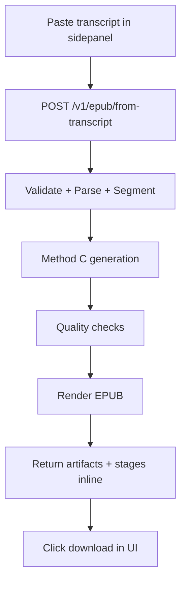

# System Flow Map + Glossary (CN/EN)

Date: 2026-03-05  
Scope: transcript -> EPUB primary product chain (`extension sidepanel` + `backend /v1/epub/from-transcript`)

## 1. System Map (Current As-Is)

## 2. Simplest Product Chain (Target Recommended)

Goal: one clear chain for a single-user product.

## 3. What To Simplify Next (Ranked)

1. Remove method fan-out in product path (`A/B` already disabled; keep `C` only).
2. Keep one public entrypoint for normal use: `/v1/epub/from-transcript`.
3. Keep EPUB as default/primary UX output; treat PDF/MD as debug/optional.
4. Keep sidepanel as the only operational UI; popup remains launcher only.
5. Keep inspector data, but hide advanced debug controls from normal workflow.
6. Keep `/v1/jobs/*` only for compatibility/debug tooling, not primary UX.

Tradeoff:
- Simpler chain improves reliability and faster debugging.
- Less method diversity means lower experimentation flexibility in production path.

## 4. Decision Note: Can We Use Only Method C?

Short answer: Yes, and this repo now uses C-only for backend generation routing.

Why:
- Better quality consistency than A/B in recent runs.
- Fewer branches in core pipeline (lower maintenance + clearer debugging).
- Aligns with "single-user, direct path" product goal.

Residual risk:
- LLM quality/availability issues still affect output quality.
- Mitigation remains inspector visibility + explicit error surfacing policy.

## 5. Glossary (CN/EN)

| 中文术语 | English Term | 一句话定义 |
| --- | --- | --- |
| 入口数据 | Entry Data | 用户提交到 API 的原始请求数据包。 |
| 请求校验 | Request Validation | 用 schema 检查字段完整性和类型合法性。 |
| 合规声明 | Compliance Declaration | 用户对用途限制的显式确认。 |
| 控制流 | Control Flow | 系统按什么顺序调用模块。 |
| 数据流 | Data Flow | 数据在各阶段如何变形与传递。 |
| 状态流 | State Flow | 任务状态如何从 idle/queued/processing 变化。 |
| 失败流 | Failure Flow | 出错后如何返回、记录和恢复。 |
| 解析 | Parsing | 把非结构化文本转成结构化对象。 |
| 结构化条目 | Structured Entries | 含 speaker/timestamp/text 的标准记录。 |
| 语义分段 | Semantic Segmentation | 按主题/提问/时间间隔切分内容段。 |
| 章节规划 | Chapter Plan | 章节标题、范围、意图的规划结果。 |
| 基线模型 | Base Model | 规则法生成的初始小册子模型。 |
| 生成策略 | Generation Strategy | 决定是否调用 LLM 及何种调用路径。 |
| 全书草稿 | Full-book Draft | LLM 一次性返回整书结构化草稿。 |
| 章节补丁 | Chapter Patch | 对单章做增补的结构化结果。 |
| 证据约束 | Evidence Constraint | 引用与结论需可在原文中找到支持。 |
| 合并 | Merge | 将 LLM 结果与规则模型融合。 |
| 质量门 | Quality Gate | 渲染前的结构和内容检查机制。 |
| 阻断问题 | Blocking Issue | 导致质量门失败的高严重度问题。 |
| 警告问题 | Warning Issue | 不阻断但需关注的质量问题。 |
| 产物 | Artifact | 生成的 EPUB/PDF/MD 文件。 |
| 内联返回 | Inline Response | 同一个请求直接返回产物与阶段信息。 |
| 可观测性 | Observability | 可追踪系统内部阶段与数据状态。 |
| 检查轨迹 | Inspector Trace | 按阶段记录 input/output/config 的日志。 |
| 回归测试 | Regression Test | 检查新改动是否让质量退步。 |
| 对比运行 | Method Comparison Run | 对同一输入做多策略运行并比较结果。 |
| 单一入口 | Single Entry Path | 面向用户只保留一条主调用路径。 |
| 最小可维护链路 | Minimal Maintainable Chain | 功能完整且复杂度最低的实现链路。 |

