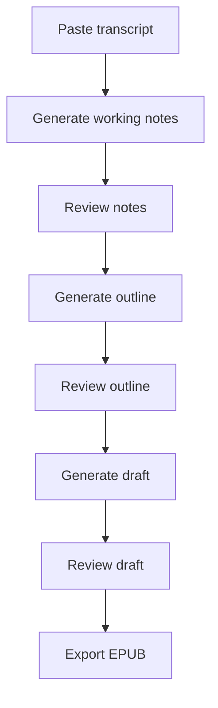
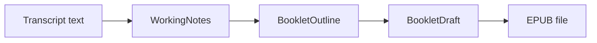
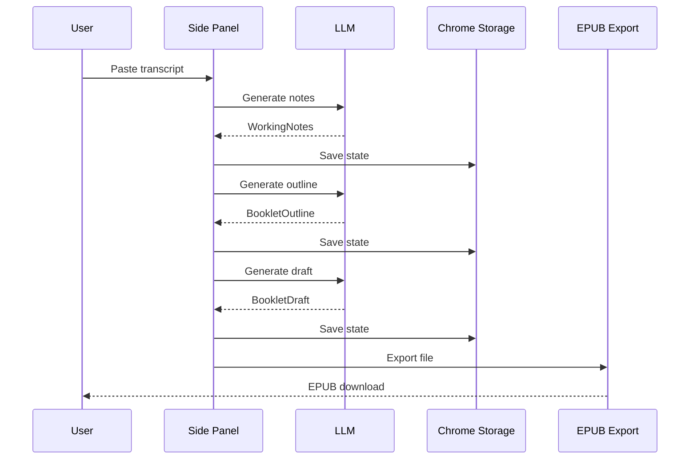

# System Flow Map + Glossary

Date: 2026-03-08  
Scope: current local extension workflow on `main`

## 1. System Map

### Diagram: Flowchart - Current local product chain

What it shows:

- the visible product chain in the side panel

Why it matters:

- this is the actual user path we are optimizing now

## 2. Data Flow

### Diagram: Flowchart - Artifact handoff

What it shows:

- each stage hands off one concrete object to the next stage

Why it matters:

- it keeps the system inspectable and makes quality debugging easier

## 3. Runtime Map

### Diagram: Sequence - Extension local execution

What it shows:

- the side panel coordinates generation directly

Why it matters:

- no local backend is required for the main flow

## 4. Stage Notes

### `WorkingNotes`

What it is:

- a compact planning artifact derived from the transcript

Why it exists:

- to let the user judge content and structure before committing to a full draft

### `BookletOutline`

What it is:

- an ordered list of proposed sections

Why it exists:

- to test whether the reading structure makes sense before writing prose

### `BookletDraft`

What it is:

- the first readable full-text version of the booklet

Why it exists:

- it is the current render input for EPUB export

## 5. What Is Intentionally Not In The Main Flow

- async jobs
- compliance declarations
- hidden fallback paths
- server-side polling UI
- required segmentation logic
- multiple output formats as part of the main happy path

## 6. Glossary

| Term | Meaning |
| --- | --- |
| transcript | The pasted raw source text. |
| working notes | A compressed, inspectable planning artifact for the next step. |
| booklet outline | Ordered section plan for the booklet. |
| booklet draft | Readable section prose used for EPUB export. |
| stage trace | Debug record of what each generation step did. |
| local export | EPUB creation inside the browser instead of a server. |
| one-pass | Treat the transcript as one input for now, without segmentation strategy. |
| inspectable pipeline | A pipeline where the user can review intermediate artifacts instead of seeing only the final file. |
