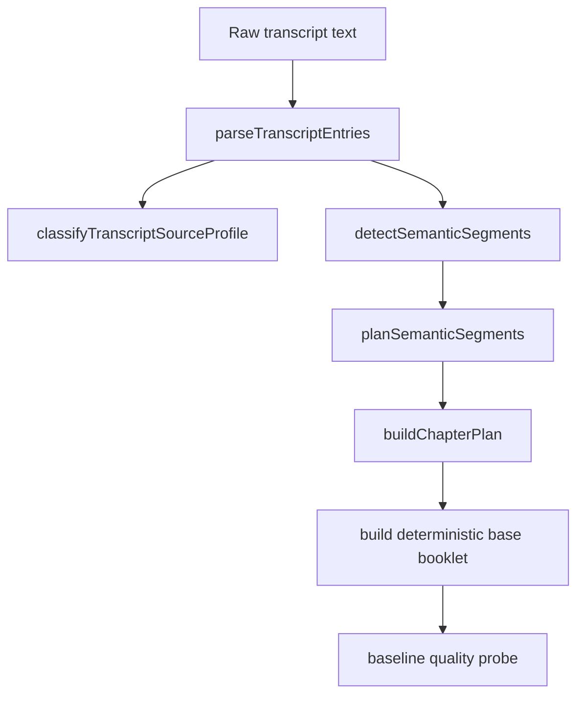
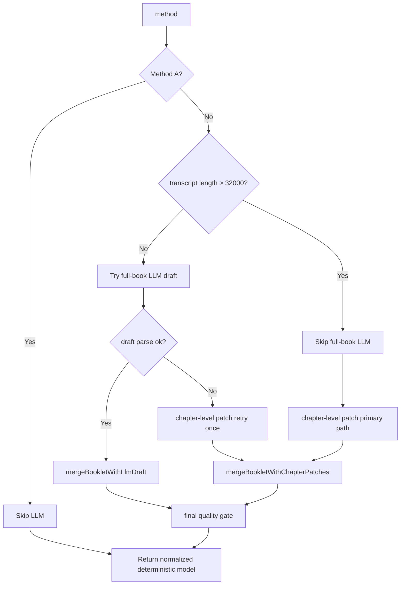
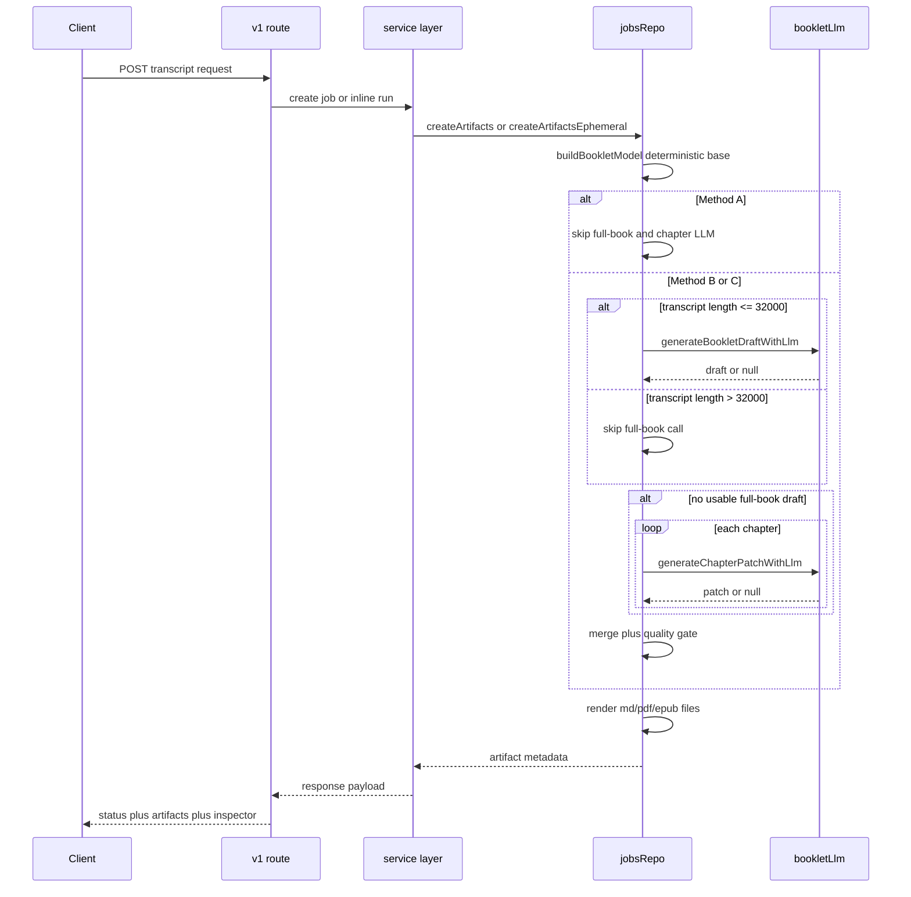

# Transcript -> LLM Generation Architecture Deep Dive

Status: implementation deep dive based on current `main` codepath (as of 2026-03-05).

Audience: product/research collaborators who want to understand how transcript text becomes generated booklet artifacts.

## 1) What This Pipeline Does

At a high level, the system takes a transcript, builds a deterministic booklet structure first, then optionally asks an LLM to improve wording and structure, then renders files (`epub`, `pdf`, `md`).

Key term definitions:

- **Deterministic base model**: a rule-based booklet generated from parsed transcript text without LLM creativity.
- **LLM enrichment**: optional model call that proposes better chapter text/summary/actions, then merged with safety caps.
- **Inspector stages**: debug events emitted during processing so we can inspect what happened.

## 2) Endpoint-Level Architecture

There are two active transcript entrypoints:

1. `POST /v1/epub/from-transcript`
2. `POST /v1/jobs/from-transcript`

The first is DB-free core path. The second is DB-backed compatibility/history path.

```mermaid
flowchart LR
  U[Client or Extension] --> R1[/v1/epub/from-transcript]
  U --> R2[/v1/jobs/from-transcript]

  R1 --> S1[createEpubFromTranscriptInline]
  R2 --> S2[createTranscriptJob]

  S2 --> J[createJob row]
  J --> P[runPipelineInline]

  S1 --> A1[createArtifactsEphemeral]
  P --> A2[createArtifacts persisted]

  A1 --> B[buildBookletModel]
  A2 --> B

  B --> L[LLM strategy plus merge]
  L --> F[render artifacts]
  F --> D[download URLs]

  D --> O1[inline response for epub endpoint]
  D --> O2[job status/artifacts endpoints]
```

Primary code references:

- Route wiring: `backend/src/routes/v1.ts`
- DB-free inline service: `backend/src/services/epubInlineService.ts`
- DB-backed job service: `backend/src/services/jobsService.ts`
- Core generation + render internals: `backend/src/repositories/jobsRepo.ts`

## 3) Transcript Normalization and Chapter Planning

`buildBookletModel(...)` is the core function.

### 3.1 Parse transcript into entries

The parser (`parseTranscriptEntries`) tries to recover structured rows:

- `speaker`
- `timestamp`
- `text`

If structure is missing, it falls back to `Speaker` + `--:--` for robust processing.

### 3.2 Infer transcript source profile

The code classifies transcript style as:

- `single`
- `interview`
- `discussion`

It uses speaker-turn density, question ratio, and discussion/interview markers to score confidence.

### 3.3 Build semantic segments and chapter plan

The planner:

- detects topic-shift or question-turn signals,
- enforces chapter count target (`5..7`),
- merges/splits segments to fit target count,
- creates chapter titles/ranges from segment chunks.



Important constants:

- Chapter count range: `MIN_CHAPTER_COUNT=5`, `MAX_CHAPTER_COUNT=7`
- Full-book LLM size threshold: `FULL_BOOK_LLM_MAX_CHARS=32000`

## 4) LLM Generation Strategy (Methods A/B/C)

`generation_method` controls behavior:

1. **Method A**: deterministic only, no LLM call.
2. **Method B**: deterministic + LLM enrichment (baseline prompt profile).
3. **Method C**: deterministic + LLM enrichment (strict template profile).



The LLM request uses `/chat/completions` with `response_format: json_object` and a strict JSON-only prompt contract.

## 5) LLM Call and Merge Safety

### 5.1 Request/response instrumentation

`generateBookletDraftWithLlm(...)` emits inspector callbacks:

- `onRequest` -> stage `llm_request`
- `onResponse` -> stage `llm_response`
- `onError` -> stage `llm_response` with fallback notes

### 5.2 Merge strategy

LLM output is never blindly trusted. Merge functions cap and sanitize fields:

- `mergeBookletWithLlmDraft`
- `mergeBookletWithChapterPatches`

Controls include:

- max list lengths (`MERGE_CAPS`),
- quote evidence checks against parsed transcript lines,
- fallback strings when evidence is insufficient.

### 5.3 Quality gate

Quality issues are classified into:

- **blocking issues** (must fail gate)
- **warning issues** (allowed up to threshold)

Gate rule:

- pass iff `blockingIssues.length === 0` and warning count `<= 4`

## 6) End-to-End Runtime Sequence



## 7) Inspector Stage Map (What You Can Observe)

Current stage enum in code:

1. `transcript`
2. `normalization`
3. `llm_request`
4. `llm_response`
5. `pdf`

Note: explicit inspector stage emission currently exists for PDF rendering; EPUB/MD rendering does not emit dedicated stage events yet.

## 8) Configuration and Provider Selection

LLM config is resolved from env with OpenRouter/OpenAI compatibility:

- API key: `OPENROUTER_API_KEY` or `OPENAI_API_KEY`
- Base URL fallback: OpenRouter or OpenAI defaults
- Model fallback: OpenRouter default `google/gemini-3-flash`, OpenAI default `gpt-4.1-mini`
- Timeout default: `45000ms`
- Input max chars default: `80000`

Code reference: `backend/src/config.ts`

## 9) Practical Debugging Checklist

When output quality looks wrong, check in this order:

1. `transcript` inspector stage: input char count and preview.
2. `normalization` stage: source profile chosen and quality issue list.
3. `llm_request` and `llm_response`: whether full-book parse succeeded.
4. fallback note in `llm_response`: whether chapter patch path was used.
5. final artifacts for format-specific rendering issues.

This sequence usually isolates whether the issue came from parsing, planning, LLM generation, merge, or rendering.
