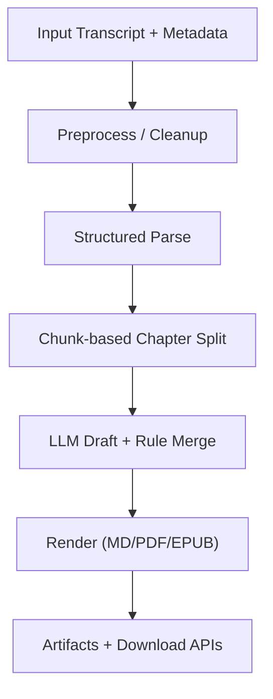
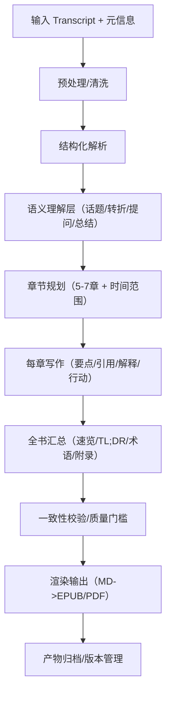

# Transcript Pipeline v2 Blueprint

## 1. Purpose

This document defines a semantic-first generation pipeline for higher-quality ebook outputs.
It contains:

- current pipeline (`As-Is`) and where quality bottlenecks occur
- target pipeline (`To-Be`) centered on understanding before writing
- intermediate data contracts and quality gates
- phased implementation plan with acceptance criteria

Scope: backend generation pipeline (`transcript -> booklet model -> markdown/pdf/epub`).

## 2. As-Is Pipeline



### 2.1 As-Is Node Mapping (Code)

- `A Input`: `POST /v1/jobs/from-transcript` request body
  - `backend/src/routes/v1.ts`
- `B Preprocess`: metadata stripping and sentence normalization
  - `extractTranscriptBody`, `sanitizeSentence`, `isMeaningfulSentence`
  - `backend/src/repositories/jobsRepo.ts`
- `C Structured Parse`: transcript line parsing into utterances
  - `parseTranscriptEntries` => `TranscriptEntry[]`
  - `backend/src/repositories/jobsRepo.ts`
- `D Chapter Split`:
  - `splitIntoChunks(entries, CHAPTER_COUNT)` (uniform bucket, not semantic boundary)
  - `backend/src/repositories/jobsRepo.ts`
- `E LLM Draft + Merge`:
  - `generateBookletDraftWithLlm` + `mergeBookletWithLlmDraft`
  - quote evidence validation currently exists, but TL;DR/actions are not fully evidence-bound
  - `backend/src/services/bookletLlm.ts`
  - `backend/src/repositories/jobsRepo.ts`
- `F Render`:
  - `buildMarkdownContent`, `writePdfArtifact`, `buildEpubChapterFiles`
  - `backend/src/repositories/jobsRepo.ts`
- `G Artifact serving`:
  - `createArtifacts`, `/v1/jobs/:id/artifacts`, `/downloads/...`
  - `backend/src/repositories/jobsRepo.ts`, `backend/src/routes/v1.ts`, `backend/src/routes/downloads.ts`

### 2.2 Current Bottlenecks

- chapter split is time-ordered chunking, not topic-turn-aware semantic segmentation
- chapter explanation content may be template-like when LLM draft is weak
- evidence checks currently focus on quotes; other summary layers are less constrained
- no explicit global quality gate before rendering

## 3. To-Be Pipeline (Semantic-First)



This extends the proposed chart by splitting `章节切分` into:

- `语义理解层`: detect discourse turns first
- `章节规划`: then assign chapter boundaries and labels

## 4. Intermediate Contracts

## 4.1 Utterance Contract

```json
{
  "id": "utt_0001",
  "speaker": "Speaker 1",
  "timestamp": "12:34",
  "text": "..."
}
```

Produced by structured parse.

## 4.2 Semantic Segment Contract

```json
{
  "segment_id": "seg_01",
  "start_timestamp": "10:24",
  "end_timestamp": "16:06",
  "topic_label": "边界框架与识别",
  "signals": ["topic_shift", "host_question", "definition_block"],
  "utterance_ids": ["utt_0101", "utt_0102"]
}
```

Produced by semantic understanding layer.

## 4.3 Chapter Plan Contract

```json
{
  "chapter_index": 2,
  "title": "边界框架与识别",
  "range": "10:24 - 16:06",
  "segment_ids": ["seg_01", "seg_02"],
  "intent": "define-concepts-and-boundaries"
}
```

Produced by chapter planning layer.

## 4.4 Chapter Draft Contract (Evidence-Backed)

```json
{
  "title": "...",
  "points": [
    {
      "text": "...",
      "evidence": [{"speaker": "Speaker 2", "timestamp": "12:57", "quote": "..."}]
    }
  ],
  "quotes": [{"speaker": "Speaker 2", "timestamp": "12:57", "text": "..."}],
  "explanation": {
    "background": "...",
    "coreConcept": "...",
    "judgmentFramework": "...",
    "commonMisunderstanding": "..."
  },
  "actions": [
    {
      "text": "...",
      "evidence": [{"speaker": "Speaker 1", "timestamp": "15:34", "quote": "..."}]
    }
  ]
}
```

Produced by chapter writing layer.

## 5. Quality Gates (Pre-Render)

Gate checks run after full-book assembly and before render.

1. Evidence coverage:
   - every TL;DR item has at least one chapter evidence link
   - every chapter has at least 2 quotes with timestamp
2. Chapter completeness:
   - each chapter contains points + quotes + explanation + actions
3. Anti-hallucination:
   - unsupported quote removed or replaced with conservative fallback:
     - `未在原文中明确说明`
4. Structural compliance:
   - chapter count target: `5-7`
   - section order matches booklet contract

If gate fails:

- retry only failed chapter draft once with stricter constraints
- otherwise keep deterministic fallback for that section

## 6. Phased Implementation Plan

## Phase 1: Semantic Layer Foundation

- add `semantic segment` extraction module
- output persisted in-memory model for one job run

Acceptance:

- same input transcript yields stable segment boundaries (`>= 90%` deterministic overlap over 3 runs)

## Phase 2: Chapter Plan Refactor

- replace uniform chunking with segment-based chapter planning
- preserve target chapter count and time ranges

Acceptance:

- chapter titles/ranges align with major topic shifts
- fewer cross-topic mixed chapters than baseline

## Phase 3: Evidence-Backed Writing

- add `evidence` references for TL;DR/points/actions
- add global gate validation before render

Acceptance:

- each TL;DR line maps to at least one validated chapter evidence
- quote hallucination rate lower than baseline

## Phase 4: Quality Loop

- add chapter-level retry prompt when gate fails
- keep bounded retries (`max 1` chapter rewrite pass)

Acceptance:

- improved quality without significant latency regression (`p95 <= +20%` vs current long transcript baseline)

## 7. What To Build Next (Recommended)

1. Implement `Phase 1` + `Phase 2` first (semantic segmentation + chapter planning).
2. Then implement `Phase 3` evidence contracts for non-quote text.
3. Keep renderer unchanged until pre-render model quality is stable.

This order maximizes quality gains while minimizing rendering churn.
