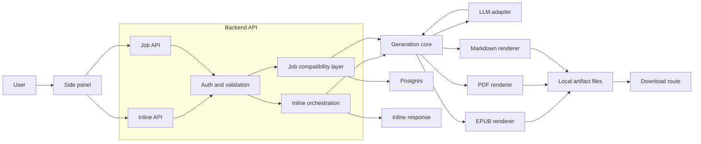
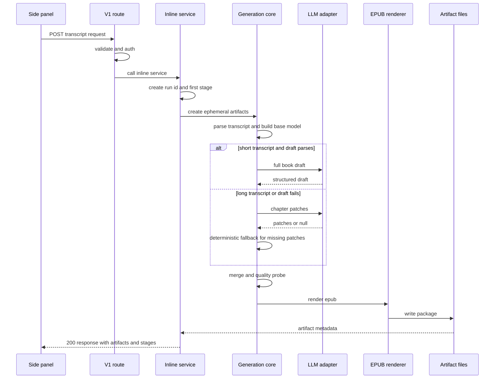
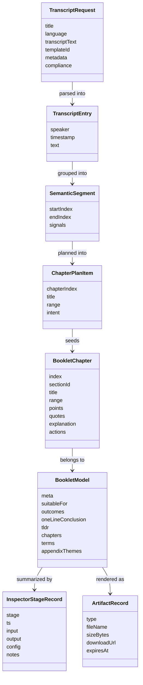
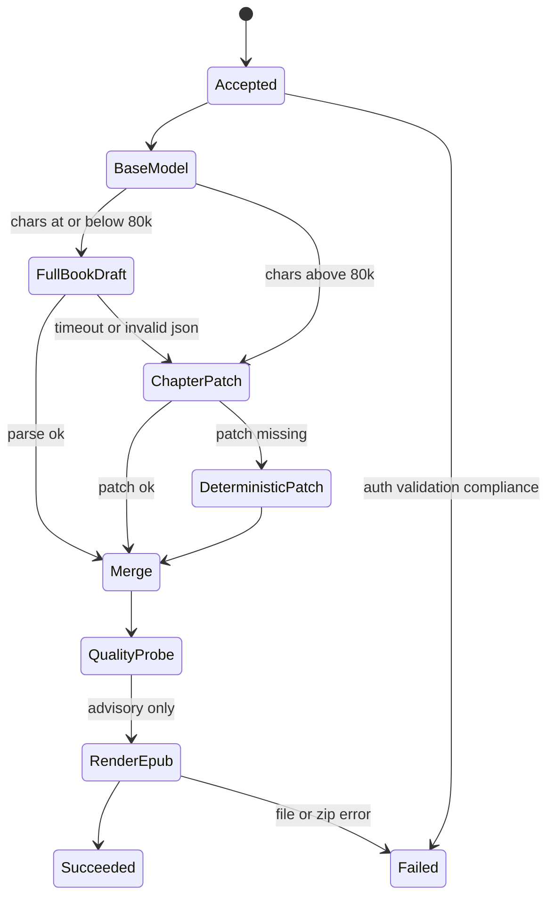
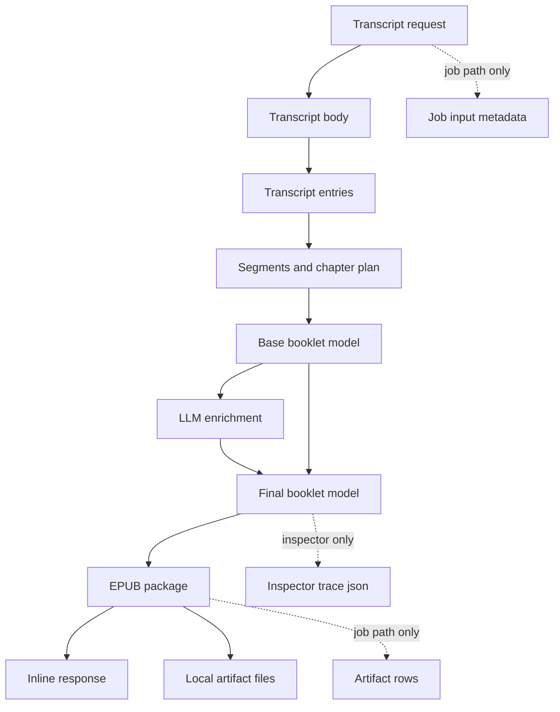
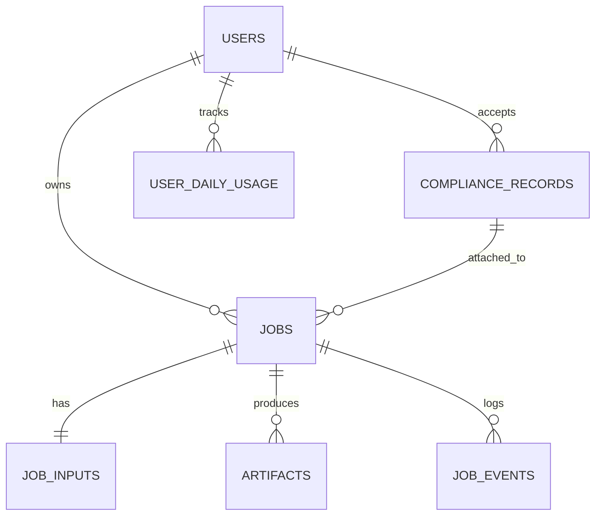

# Transcript to EPUB Architecture

Snapshot date: 2026-03-06

This document explains the current implemented generation path from transcript text to EPUB output.

It is intentionally opinionated about "what is live today" versus "what older docs still describe." The main live path is the inline `POST /v1/epub/from-transcript` flow, not the broader async job platform described in several planning docs.

## 1. Executive Summary

- The primary production path is a synchronous request pipeline: extension side panel -> authenticated API request -> inline orchestration -> transcript understanding -> booklet model construction -> EPUB packaging -> inline response.
- The core generation logic is concentrated in [`backend/src/repositories/jobsRepo.ts`](../backend/src/repositories/jobsRepo.ts), even though that file name suggests a narrower database role.
- PostgreSQL is optional for the main transcript-to-EPUB path. It is only required for compatibility and dashboard flows under `/v1/jobs/*`.
- The runtime architecture is "deterministic base model first, LLM enrichment second, deterministic fallback if needed."
- The runtime quality gate is advisory today. It records issues into inspector output but does not block rendering.

## 2. Code Map

These files are the best starting points for understanding the current path:

- [`backend/src/app.ts`](../backend/src/app.ts): Express wiring, JSON body limit, route mounting, error handling.
- [`backend/src/middleware/auth.ts`](../backend/src/middleware/auth.ts): bearer token parsing and DB-free auth behavior for the inline endpoint.
- [`backend/src/routes/v1.ts`](../backend/src/routes/v1.ts): HTTP contract for `/v1/epub/from-transcript` and `/v1/jobs/from-transcript`.
- [`backend/src/services/epubInlineService.ts`](../backend/src/services/epubInlineService.ts): inline orchestration and response shaping for `run_*` requests.
- [`backend/src/services/jobsService.ts`](../backend/src/services/jobsService.ts): DB-backed compatibility flow for `job_*` requests.
- [`backend/src/repositories/jobsRepo.ts`](../backend/src/repositories/jobsRepo.ts): transcript parsing, source profiling, chapter planning, booklet assembly, renderers, artifact persistence, inspector trace persistence.
- [`backend/src/services/bookletLlm.ts`](../backend/src/services/bookletLlm.ts): full-book and chapter-patch LLM calls plus JSON parsing.
- [`backend/src/routes/downloads.ts`](../backend/src/routes/downloads.ts): artifact download endpoint.
- [`extension/sidepanel/sidepanel.js`](../extension/sidepanel/sidepanel.js): real user entrypoint; submits to the inline EPUB endpoint.

## 3. Diagram: System Overview - Current Runtime Topology

Diagram notes:

- What it shows: the real runtime topology, including the split between the live inline path and the optional DB-backed compatibility path.
- Why it matters: many older docs describe a queue-and-worker system, but the current runtime is a single API process with optional Postgres persistence.
- Inputs: transcript text, metadata, compliance declaration, bearer token.
- Outputs: inline response payload, download URLs, optional Postgres rows.
- Boundaries: extension boundary, API boundary, optional DB boundary, external LLM boundary, local filesystem boundary.
- Failure paths: auth or validation failure at the API boundary, LLM degradation inside generation, filesystem or `zip` failure during packaging, DB-only failures on `/v1/jobs/*`.

## 4. Subsystem Breakdown

### 4.1 Extension and API Client

- Owns: user input capture, compliance checkboxes, request payload assembly, rendering inline artifacts and inspector stages.
- Depends on: configured API base URL, bearer token, backend route contracts.
- Exposes: `createEpubFromTranscript()` in [`extension/src/api/jobs.ts`](../extension/src/api/jobs.ts) and the side panel submit flow in [`extension/sidepanel/sidepanel.js`](../extension/sidepanel/sidepanel.js).
- Handoffs:
  - control handoff: browser UI -> HTTP request
  - data handoff: `title`, `language`, `transcript_text`, optional `metadata.episode_url`, compliance declaration
  - state handoff: inline response is rendered immediately; only older job flows use polling

### 4.2 HTTP Boundary and Auth Layer

- Owns: JSON parsing, Zod validation, auth requirement, DB-required guard for job endpoints, shared error envelopes.
- Depends on: Express, Zod, config, request auth middleware.
- Exposes:
  - `/v1/epub/from-transcript`
  - `/v1/jobs/from-transcript`
  - `/v1/jobs/:job_id`
  - `/v1/jobs/:job_id/artifacts`
  - `/v1/jobs/:job_id/inspector`
- Handoffs:
  - control handoff: validated request -> inline service or jobs service
  - data handoff: parsed request body plus resolved auth user
  - failure handoff: Zod errors become `400 INVALID_INPUT`; missing DB becomes `503 DB_REQUIRED` for job endpoints

### 4.3 Inline Orchestration

- Owns: compliance enforcement, `run_*` ID creation, initial transcript inspector stage, EPUB-only mode, final inline response shape.
- Depends on: `createArtifactsEphemeral()` from the generation layer and `createId()` from the ID helper.
- Exposes: `createEpubFromTranscriptInline()` in [`backend/src/services/epubInlineService.ts`](../backend/src/services/epubInlineService.ts).
- Handoffs:
  - control handoff: orchestration -> generation core
  - data handoff: normalized title, source reference, generation method, inspector callback
  - state handoff: accumulates in-memory inspector stages and returns them inline

### 4.4 Generation Core

- Owns: transcript cleanup, transcript entry parsing, source-profile classification, semantic segmentation, chapter planning, deterministic booklet base model, LLM merge, quality probes, render-layout preview, and artifact generation.
- Depends on: LLM adapter, config, PDFKit, filesystem, zip CLI, optional DB connection.
- Exposes:
  - `buildBookletModel()`
  - `createArtifacts()`
  - `createArtifactsEphemeral()`
  - artifact listing and inspector trace helpers
- Handoffs:
  - data handoff in: transcript text, title, language, source metadata, generation method
  - data handoff out: `BookletModel`, artifact metadata, inspector stages, optional DB rows
  - state handoff: runtime quality findings are emitted into inspector output rather than blocking execution

### 4.5 LLM Adapter

- Owns: prompt construction, network calls, timeout handling, JSON parsing, and "return `null` on soft failure" behavior.
- Depends on: config defaults, fetch, upstream model endpoint.
- Exposes:
  - `generateBookletDraftWithLlm()`
  - `generateChapterPatchWithLlm()`
- Handoffs:
  - control handoff: generation core decides whether to call the full-book path or chapter-patch path
  - data handoff: transcript text or chapter excerpt plus chapter plan hints
  - failure handoff: invalid or missing LLM output returns control to deterministic fallback logic

### 4.6 Renderers and Artifact Serving

- Owns: Markdown rendering, PDF rendering, EPUB packaging, checksum calculation, local artifact writes, download serving.
- Depends on: filesystem, temp directories, `zip`, PDFKit, config public base URL.
- Exposes:
  - `prepareArtifactFile()`
  - `writePdfArtifact()`
  - `writeEpubArtifact()`
  - `/downloads/:job_id/:file_name`
- Handoffs:
  - data handoff in: final booklet model
  - data handoff out: `.dev-artifacts/<id>/<id>.<format>` files and download metadata
  - failure handoff: packaging or file IO errors fail the request or background run

### 4.7 DB-Backed Compatibility Layer

- Owns: `job_*` IDs, persistence to `jobs`, `job_inputs`, `artifacts`, live inspector traces for dashboard flows, and compatibility polling endpoints.
- Depends on: Postgres, generation core, shared error handling.
- Exposes: `createTranscriptJob()` and the `/v1/jobs/*` route family.
- Handoffs:
  - control handoff: API route -> `jobsService` -> same generation core as inline
  - data handoff: full transcript is stored inside `job_inputs.metadata.transcript_text`
  - state handoff: coarse job status lives in the `jobs` table, detailed stage data lives in `job_inputs.metadata.inspector_trace`

## 5. Diagram: Sequence - Inline Transcript to EPUB

Diagram notes:

- What it shows: the actual happy path and fallback path for the main live endpoint.
- Why it matters: the runtime is not "LLM or nothing." It always starts from a deterministic base and only then tries to enrich.
- Inputs: validated transcript request, auth user, optional episode URL.
- Outputs: inline artifact metadata, inspector stages, download URL.
- Transitions: route -> inline service -> generation core -> optional LLM -> renderer -> filesystem -> response.
- Boundaries: HTTP boundary, LLM network boundary, local filesystem boundary.
- Failure paths:
  - validation or compliance failure stops before generation
  - full-book LLM failure falls back to chapter patches
  - chapter patch failure falls back to deterministic chapter content
  - packaging failure bubbles out as request failure

## 6. Diagram: Domain Model - Runtime Objects

Diagram notes:

- What it shows: the main in-memory domain objects, which are more important to the current architecture than the SQL schema.
- Why it matters: the generation pipeline is fundamentally a model transformation pipeline, not a CRUD workflow.
- Inputs: transcript request fields and transcript lines.
- Outputs: booklet model, artifact metadata, inspector stages.
- Boundaries: `TranscriptRequest` belongs to the HTTP layer, `ArtifactRecord` belongs to the render/output layer.
- Failure paths: malformed or weak intermediate objects do not always stop execution; they may trigger conservative fallbacks instead.

## 7. Diagram: State Machine - Generation Strategy and Fallback

Diagram notes:

- What it shows: the implemented strategy machine for one transcript run.
- Why it matters: it captures the core design choice of "fail soft on content generation, fail hard on packaging and API boundary errors."
- Inputs: transcript length, LLM availability, parse quality.
- Outputs: final booklet model or request failure.
- Transitions: deterministic base -> optional LLM -> deterministic patch fallback -> merge -> advisory quality probe -> render.
- Important boundary: the quality probe is not a blocking gate today. It records issues but still allows rendering.
- Failure paths:
  - hard stop on auth, validation, compliance, or packaging failure
  - soft fallback on full-book or chapter-level LLM failure

## 8. Diagram: Data Flow - Inline Path Versus Job Compatibility Path

Diagram notes:

- What it shows: where the important data actually lives while the request is running.
- Why it matters: the current architecture is dominated by in-memory transformation, with DB persistence added only for compatibility flows.
- Inputs: transcript request payload.
- Outputs: booklet model, files, inline response, optional DB metadata.
- Boundaries: inline path stops at local files and response; job path additionally stores metadata and artifact rows.
- Failure paths: if the DB is disabled, the inline path still works because the main data flow does not require Postgres.

## 9. Diagram: ERD - Persisted Compatibility Schema

Diagram notes:

- What it shows: the documented database shape behind the compatibility and dashboard flow.
- Why it matters: reviewers need to separate the SQL model from the real runtime model. The SQL schema exists, but the live inline path can bypass most of it.
- Inputs: job creation data, compliance acceptance, artifact metadata.
- Outputs: persisted compatibility records for polling, download listing, and debugging.
- Boundaries: this ERD only applies when `DATABASE_URL` is configured and the `/v1/jobs/*` path is used.
- Failure paths and caveats:
  - `job_events` is documented in schema and state-machine docs, but the current code writes inspector traces into `job_inputs.metadata` instead.
  - `user_daily_usage` exists in schema but is not enforced in the current code path.

## 10. API and Storage Schematic

### Implemented API surfaces

| Surface | Current role | Persistence | Notes |
| --- | --- | --- | --- |
| `POST /v1/epub/from-transcript` | primary live transcript-to-EPUB route | no DB required | always inline, always EPUB-only, returns `run_*` |
| `POST /v1/jobs/from-transcript` | compatibility and dashboard route | requires DB | returns `job_*`, can request multiple formats |
| `GET /v1/jobs/:job_id` | job polling | requires DB | coarse status only |
| `GET /v1/jobs/:job_id/artifacts` | artifact listing | requires DB | lists `artifacts` rows |
| `GET /v1/jobs/:job_id/inspector` | inspector trace | requires DB | reads `job_inputs.metadata.inspector_trace` |
| `GET /downloads/:job_id/:file_name` | file serving | filesystem always; DB optionally | inline `run_*` downloads bypass DB lookup |

### Implemented storage model

| Store | Used by | What is stored |
| --- | --- | --- |
| in-memory request state | inline and job flows | current inspector stage list, current booklet model during processing |
| `.dev-artifacts/<id>/` | inline and job flows | actual `.epub`, `.pdf`, `.md` files |
| `jobs` | job flow only | coarse job lifecycle state |
| `job_inputs.metadata` | job flow only | transcript text, inspector trace, other raw metadata |
| `artifacts` | job flow only | persisted artifact metadata |

## 11. Key Design Decisions and Invariants

### 11.1 Deterministic first, LLM second

- The pipeline always builds a deterministic base booklet model before calling the LLM.
- The LLM can enrich or patch content, but it does not define the initial chapter skeleton.
- This matters because the system can keep producing an EPUB even when the LLM fails.

### 11.2 Generation method is effectively fixed to `C`

- `GenerationMethod` includes `A`, `B`, and `C`, but the request path currently always resolves to `C`.
- That means the public API exposes less behavioral choice than the internal types suggest.

### 11.3 EPUB is the only output on the main live route

- The inline endpoint hardcodes `formats: ["epub"]`.
- PDF and Markdown renderers still exist, but they are only reachable through the DB-backed compatibility flow.

### 11.4 Inspector stages are the real fine-grained state model

- The `jobs` table only tracks coarse state such as `queued`, `pipeline`, `completed`, and `failed`.
- The richer runtime story lives in inspector stage records such as `transcript`, `normalization`, `llm_request`, and `llm_response`.

### 11.5 Quality gate is advisory, not blocking

- The system records quality issues into inspector output.
- It does not stop rendering when the final quality gate fails.
- This is an important invariant because "quality gate" may sound stronger than what the code actually enforces.

### 11.6 Artifact expiry is partly cosmetic for inline runs

- Inline responses include `expires_at`.
- The `run_*` filesystem download path is still served via `?token=dev` and does not enforce that expiry timestamp.

## 12. Mismatches, Ambiguities, and Doc Drift

| Area | What docs say | What code does now | Why it matters |
| --- | --- | --- | --- |
| product scope | `docs/v1-spec.md` describes audio, RSS, link, async jobs, and all three formats as V1 | main live path is transcript only, inline, EPUB only | reviewers need to know which scope is implemented versus planned |
| endpoint relationship | `docs/openapi.v1.yaml` describes `/v1/epub/from-transcript` as an alias of `/v1/jobs/from-transcript` | routes are separate and behave differently | auth, DB requirements, response codes, and ID prefixes differ |
| stage model | `docs/job-state-machine.md` describes queue-worker stages like `render_epub` and `packaging` | runtime inspector stages are `transcript`, `normalization`, `llm_request`, `llm_response`, and optional `pdf` | dashboards and docs can mislead readers about observability data |
| generation pipeline | `docs/transcript-pipeline-v2.md` still says the as-is split is uniform chunking from `/v1/jobs/from-transcript` | current code uses semantic segmentation and chapter planning in the live path | the newer pipeline is better than the stale "as-is" description suggests |
| storage semantics | schema comments say raw input should live in object storage | transcript text is stored directly inside `job_inputs.metadata` for job flows | data retention and privacy assumptions differ from the comment |
| eventing | schema and state-machine docs imply `job_events` is required | current code stores inspector traces in `job_inputs.metadata` and appears not to write `job_events` | monitoring and data-model expectations diverge |
| traceability | docs imply durable source linkage | responses may use synthetic `generated_at` and fallback `internal://source-ref` | downstream consumers should treat traceability as useful but not fully durable |

## 13. Risks and Limitations

### 13.1 Architectural concentration in `jobsRepo.ts`

- The repository file owns parsing, generation, rendering, and persistence responsibilities.
- This keeps the project simple for now, but it makes boundaries blurry and increases the blast radius of future edits.

### 13.2 No durable background worker

- The DB-backed compatibility path starts work inside the API process.
- A process crash can interrupt a "background" run because there is no external queue or worker checkpointing.

### 13.3 Advisory quality gate

- Weak content can still be rendered if packaging succeeds.
- This is a deliberate simplicity tradeoff, but it means "success" does not guarantee high content quality.

### 13.4 Local-file artifact storage

- Artifacts are written to local disk under `.dev-artifacts`.
- This is easy to debug but does not yet provide production-grade retention, cleanup, or signed URL behavior.

### 13.5 Synthetic expiry and traceability

- `expires_at` for inline runs is not enforced by the download route.
- `source_ref` can fall back to an internal placeholder when the request lacks `metadata.episode_url`.

### 13.6 Hard-coded LLM defaults

- The LLM base URL and model are fixed in config defaults.
- This reduces operational choice and makes upstream changes more coupled to code changes.

## 14. Open Questions

1. Should the live product continue to treat `/v1/epub/from-transcript` as the primary surface, with `/v1/jobs/*` explicitly downgraded to debug-only compatibility?
2. Should the quality gate become blocking for at least a subset of issues, or is visibility-only the right tradeoff for now?
3. Should inline downloads enforce `expires_at`, or should the API stop advertising expiry until it is truly enforced?
4. Should transcript text remain in `job_inputs.metadata`, or should the project align with the schema comment and move raw inputs out of Postgres?
5. Should `GenerationMethod` stay in internal types if only method `C` is reachable?
6. Should the project update or archive stale docs such as `docs/v1-spec.md`, `docs/job-state-machine.md`, and the "As-Is" section of `docs/transcript-pipeline-v2.md`?

## 15. Recommended Reading Order

1. Read this document for the implemented architecture.
2. Read [`README.md`](../README.md) for the current developer workflow and the current flow map.
3. Read [`backend/src/routes/v1.ts`](../backend/src/routes/v1.ts) and [`backend/src/services/epubInlineService.ts`](../backend/src/services/epubInlineService.ts) for the live route contract.
4. Read [`backend/src/repositories/jobsRepo.ts`](../backend/src/repositories/jobsRepo.ts) for the generation and rendering internals.
5. Treat [`docs/v1-spec.md`](../docs/v1-spec.md), [`docs/job-state-machine.md`](../docs/job-state-machine.md), and parts of [`docs/openapi.v1.yaml`](../docs/openapi.v1.yaml) as mixed current-plus-planned context rather than a precise runtime description.
