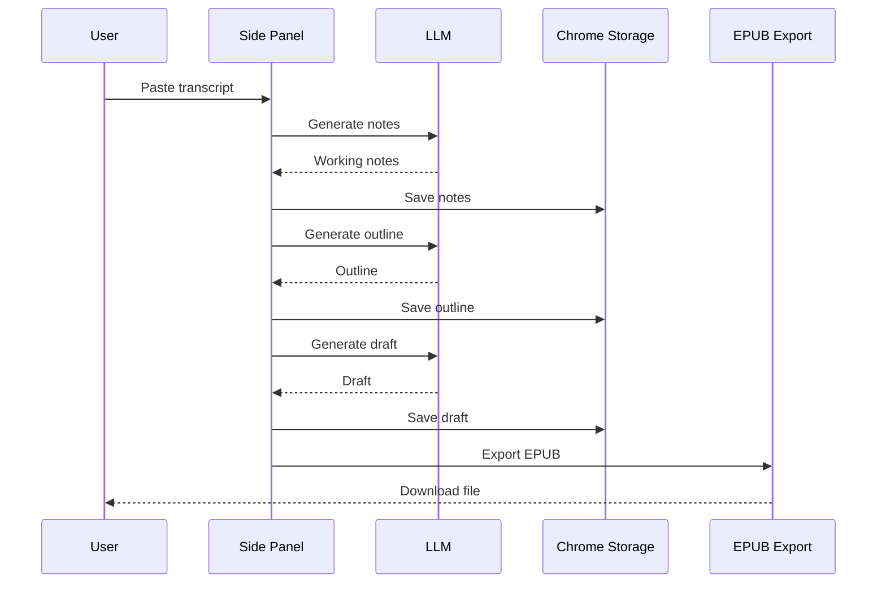

# Podcasts_to_ebooks V1 Spec

This document describes the current product path on `main`.

The current V1 is a local extension workflow, not an async jobs platform.

Related docs:

- `README.md`
- `extension/README.md`
- `docs/system-flow-map-and-glossary.md`

## 1. Scope

- Product form: Chrome extension side panel
- Primary input: pasted transcript text
- Primary output: EPUB
- Execution model: local staged generation inside the extension
- Storage model: `chrome.storage.local`
- Main user loop: inspect each intermediate artifact before exporting

## 2. Core Product Flow

The current product flow is:

`transcript -> working notes -> booklet outline -> booklet draft -> epub`

Why this shape:

- it keeps the workflow inspectable
- it avoids jumping straight from transcript to final file
- it gives us real intermediate artifacts to judge for quality

## 3. Current Stage Contracts

### `WorkingNotes`

Purpose:
- compress a raw transcript into a small, inspectable planning artifact

Schema:

```ts
type WorkingNotes = {
  title: string
  summary: string[]
  sections: {
    heading: string
    bullets: string[]
    excerpts: string[]
  }[]
}
```

Rules:

- `summary` should be concrete, not generic filler
- `sections` should be a small set of candidate chunks
- `excerpts` should stay close to transcript wording
- this object is not the final booklet

### `BookletOutline`

Purpose:
- turn working notes into a proposed reading order

Schema:

```ts
type BookletOutline = {
  title: string
  sections: {
    id: string
    heading: string
    goal?: string
  }[]
}
```

Rules:

- `sections` must be ordered
- `goal` is short and optional
- outline is still planning, not prose

### `BookletDraft`

Purpose:
- turn the outline into readable section text

Schema:

```ts
type BookletDraft = {
  title: string
  sections: {
    id: string
    heading: string
    body: string
  }[]
}
```

Rules:

- each section must have real body text
- this is the render input for the current EPUB export

## 4. Execution Model

### Diagram: Sequence - Local staged generation



What it shows:

- the extension owns the main execution path

Why it matters:

- there is no required queue, worker, or local server in the main user flow

## 5. Storage and State

The extension stores local workspace state in `chrome.storage.local`.

That includes:

- transcript input
- LLM settings
- latest `WorkingNotes`
- latest `BookletOutline`
- latest `BookletDraft`
- stage trace
- last local artifact summary

## 6. Observability

The current product path should stay inspectable.

That means the user can see:

- the output of each stage
- the order the stages ran
- stage inputs, outputs, config, and notes in the trace panel

The point of this is simple:

- if quality is bad, we want to see where it went bad

## 7. Current Constraints

- Transcript input is capped before the LLM call.
- Generation is one-pass for now.
- No segmentation is part of the main product path yet.
- EPUB is the only required export in the current UI.

## 8. Out of Scope Right Now

These are not part of the current main product contract:

- async jobs
- `/v1/jobs/*` as the primary product surface
- compliance declaration payloads
- required PDF/Markdown generation
- RSS ingestion
- audio upload
- hosted multi-user orchestration

Some older backend code and docs still exist in the repo, but they should be treated as legacy or experimental unless explicitly revived.
